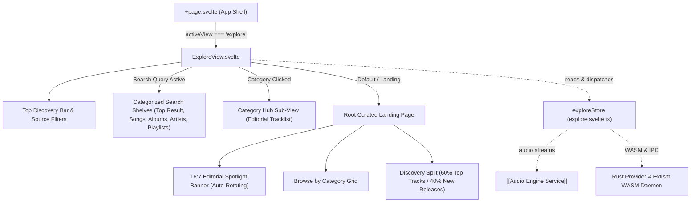
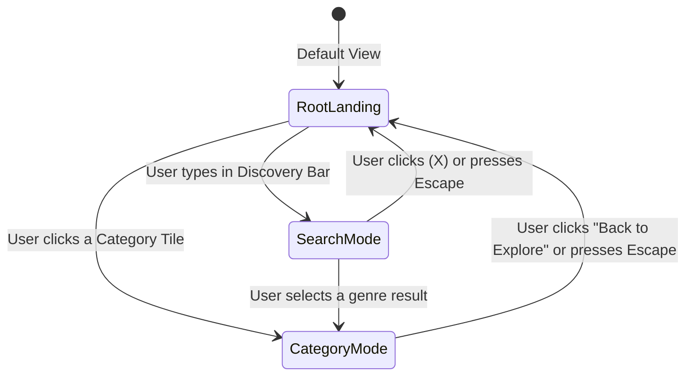
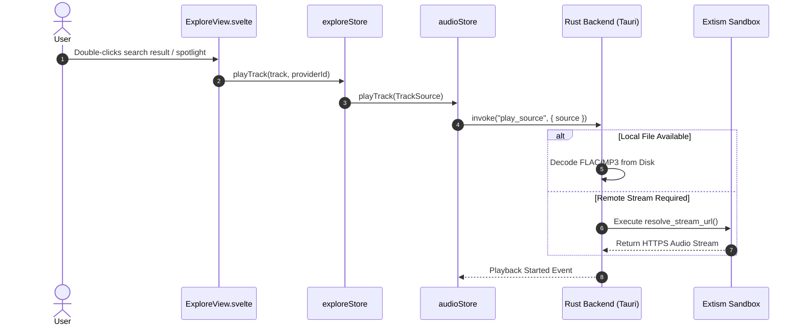

# Explore Route & Global Discovery Engine

## In Plain English: What is the Explore Page?
While the **[[Homepage Route]]** is your personal listening cockpit tailored to your past habits, the **Explore Page** is your gateway to the broader musical universe. It allows you to search, sample, and discover new songs, full albums, emerging artists, and editorial playlists from across both your local storage and federated sandboxed streaming extensions (WASM).

When you open Explore:
1. **Curated Editorial Spotlight:** A cinematic 16:7 hero carousel showcases featured releases, complete with lossless badges and one-click playback.
2. **Category Hubs:** Symmetrical color-accented tiles let you dive into specific genres (Jazz, Electronic, Neo-Classical, Ambient, etc.).
3. **Discovery Split (60% / 40%):** A ranked leaderboard of *Top Global Tracks* sits beside a modern 2×2 visual showcase of *New Releases*.
4. **Universal Multi-Source Search:** An instant search bar queries across local files and remote streaming providers simultaneously, separating results into dedicated shelves (*Top Result*, *Songs*, *Albums*, *Artists*, *Playlists*).



---

## Key User Experiences & Layout Modes

The Explore page seamlessly transitions between three specialized layout modes without full-page reloads:



### 1. Root Curated Landing
The default landing view designed for effortless musical discovery:
* **Featured Spotlight Banner:** 16:7 wide-format editorial card featuring dynamic background blur, release metadata, lossy/lossless badges, and tactile `<` `• • •` `>` carousel steppers with a 7-second auto-scroll timer that pauses on hover.
* **Browse by Category:** 4-column responsive grid of high-contrast genre tiles accented with custom hardware-inspired color bars.
* **Top Global Tracks Ledger (60% width):** Ranked numbered ledger with album squircle art, hover play overlays, durations, and active track equalizer visualizers.
* **New Releases (40% width):** 2×2 high-res album showcase with floating play bubbles and inline artist routing.

### 2. Universal Search Results Canvas
Activated immediately as the user types in the discovery input:
* **Filter Chips:** Fast sub-filtering by `All`, `Songs`, `Albums`, `Artists`, or `Playlists`.
* **Multi-Select Source Menu:** Dynamic dropdown allowing users to selectively query specific sandboxed extensions or local indexed files.
* **Top Result Card:** High-prominence spotlight card for exact matches with immediate play actions and artist links.
* **Ranked & Symmetrical Shelves:** Songs are presented in numbered ledgers while Albums and Artists appear in clean symmetrical card grids with "See More" category expansion.

### 3. Category Hub Sub-View
Activated when any category tile (e.g., *Modern Jazz*, *Synthwave*) is clicked:
* **Curated Editorial Feed:** Deep tracklist compiled for that specific genre or mood.
* **Header & Quick Navigation:** Prominent category color badge, description, and instantaneous <kbd>Esc</kbd> / Back button support.

---

## Technical Architecture & State Pipeline

### File Structure & Coordinates
* **Main Visual Shell:** `src/lib/components/ExploreView.svelte`
* **State Store:** `src/lib/stores/explore.svelte.ts` (`exploreStore`)
* **Audio Engine Integration:** `src/lib/stores/audio.svelte.ts` (`audioStore`)
* **Provider System & Rust IPC:** `src-tauri/src/providers/` (`recommendations.rs`, `youtube.rs`)

### Reactive Store Architecture (`exploreStore`)
Built purely with Svelte 5 runes (`$state`, `$derived`, `$effect`):

```typescript
class ExploreStore {
    // Search state
    searchQuery = $state("");
    activeSearchFilter = $state<"all" | "songs" | "albums" | "artists" | "playlists">("all");
    activeSourceFilters = $state<string[]>(["local", "youtube-wasm"]);
    
    // Curated content
    spotlights = $state<SpotlightItem[]>([]);
    activeSpotlightIndex = $state(0);
    categoryGrid = $state<GenreItem[]>([]);
    rankedTracks = $state<TrackResult[]>([]);
    newReleases = $state<AlbumItem[]>([]);

    // Active sub-views
    activeCategory = $state<GenreItem | null>(null);
    categoryTracks = $state<TrackResult[]>([]);
    activeDrawerCollection = $state<CollectionData | null>(null);

    // Derived filtered datasets
    filteredRankedTracks = $derived.by(() => { ... });
    filteredNewReleases = $derived.by(() => { ... });
    searchSections = $derived.by(() => { ... });
}
```

---

## Audio Resolution & Fallback Strategy

When a user initiates playback from Explore:
1. **Local Check:** Echo first verifies if the track exists locally in the user's SQLite catalog using its canonical key (`normalize(artist) + "_" + normalize(title)`).
2. **Provider Resolution:** If the file is not found on disk, Echo dispatches an asynchronous resolution call across enabled Extism WASM streaming plugins.
3. **Queue Ingestion:** The resolved audio stream is marshaled into the lock-free `rodio` playback thread via the queue actor.



---

## Design System & Styling Tokens

The Explore page follows Echo's warm, high-contrast, hardware-inspired design tokens:

| Token / Property | Value | Usage |
| :--- | :--- | :--- |
| **Primary Accent** | `#B58E62` / `#D4A86E` | Badges, active highlights, play buttons, and focus outlines |
| **Canvas Background** | `var(--echo-void, #0A0A0C)` | Deep matte obsidian background |
| **Card Surface** | `#141416` / `rgba(255, 255, 255, 0.04)` | Shelf card containers and tiles |
| **Bottom Clearance** | `var(--player-clearance, 10rem)` | Prevents the floating player island from obstructing trackrows |
| **Scroll Padding** | `var(--player-scroll-padding, 10rem)` | Ensures clean keyboard scrolling and anchor snapping |

---

## Keyboard Shortcuts & Accessibility

* <kbd>Esc</kbd> — Instantly clears active search query or exits Category Hub back to the root landing page.
* <kbd>Enter</kbd> — Activates selected search result, category tile, or album card.
* <kbd>Double-Click</kbd> — Immediately plays any track row and loads surrounding tracks into Up Next.
* <kbd>Ctrl</kbd> + <kbd>K</kbd> — Focuses the global discovery search input from anywhere in the application.

---

## Related Notes & Documentation
* [[Architecture MOC]] — Master map of Echo's system architecture.
* [[Homepage Route]] — The personal recommendation cockpit.
* [[Audio Engine Service]] — Non-blocking audio thread and playback pipeline.
* [[Extension Sandbox Service]] — Sandboxed Extism WASM runtime and BotGuard JS attestation.
