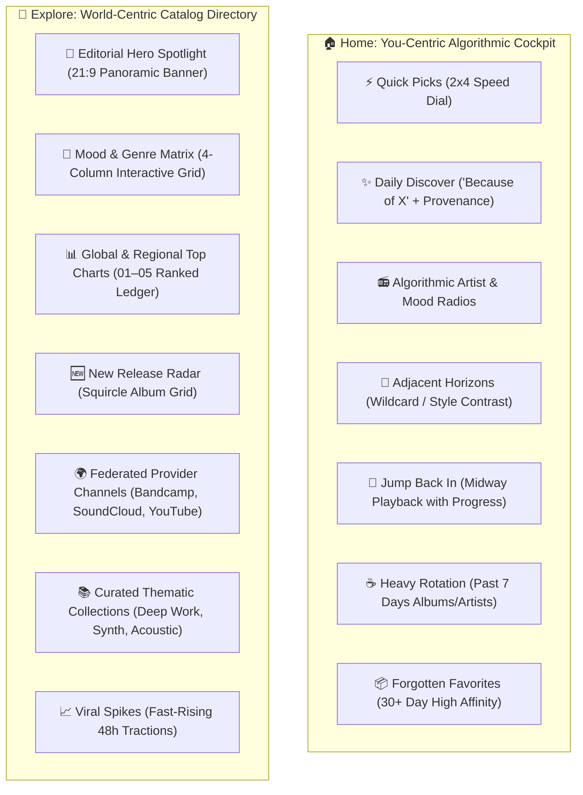

# Echo Desktop — Home & Explore Dual-Core Experience Specification

**Document Version:** 1.0.0  
**Target Architecture:** Echo Desktop (Svelte 5 Runes, Rust Tauri 2.0, SQLite WAL, Extism WASM Providers)  
**Status:** Approved Architectural Specification  

---

## 1. Executive Summary & Architectural Philosophy

Echo Desktop fundamentally rejects the homogenization of music discovery. Many modern players blur the lines by dumping generic global streaming API browse endpoints onto every screen. 

Echo enforces a **strict dual-core separation of concerns**:

```
┌────────────────────────────────────────────────────────────────────────────┐
│                             ECHO ARCHITECTURE                              │
├─────────────────────────────────────┬──────────────────────────────────────┤
│    🏠 HOME: YOU-CENTRIC COCKPIT     │    🧭 EXPLORE: WORLD-CENTRIC DIRECTORY│
│    (Personal / Algorithmic Engine)  │    (Catalog Discovery & Deep Dive)   │
├─────────────────────────────────────┼──────────────────────────────────────┤
│ • Grounded in your listening history│ • Global charts, trends, and releases│
│ • Federated per-seed recommendations│ • Comprehensive Mood & Genre Matrix  │
│ • Instant cold-start via local DB   │ • Multi-provider source channels     │
│ • Wildcard contrast & mood mixes    │ • Editorial spotlights & collections │
│ • Zero generic storefront clutter   │ • Deep genre & category exploration  │
└─────────────────────────────────────┴──────────────────────────────────────┘
```

* **Home (`HomeView.svelte`):** A high-density, algorithmically-driven personal dashboard. Every single element is directly tied to the listener’s unique telemetry, local library, liked tracks, or algorithmic extensions.
* **Explore (`ExploreView.svelte`):** A broad, expansive world catalog directory designed for purposeful browsing, genre deep-dives, global trends, and editorial discovery across connected WASM extensions.

---

## 2. Comprehensive Section Catalogs



---

## 3. Home View: Deep Dive & Layout Specifications

### 3.1. ⚡ Quick Picks (Speed Dial)
* **Design & Layout:** A compact $2 \times 4$ responsive card grid designed for immediate muscle-memory playback upon opening the app.
* **Data Origin:** High-frequency songs from `song_telemetry` ordered by a composite affinity score:
  $$\text{Score} = (\text{play\_count} \times 2.0) + (\text{liked} \times 5.0) - (\text{days\_since\_last\_play} \times 0.2)$$
* **Card Anatomy:** 
  * Micro artwork thumbnail with instant play/pause hover bubble.
  * Truncated track title and artist name.
  * One-click reactive like/heart icon toggle.
  * Real-time equalizer animation indicator when currently active.

### 3.2. ✨ Daily Discover ("Because You Listened to X")
* **Design & Layout:** Horizontal card carousel (aspect ratio 1:1 with rounded squircle art).
* **Provenance Attribution:** Every track card prominently displays an attribution pill:
  * e.g., *"Similar to Radiohead"*, *"Because you played Daft Punk"*.
* **Resolution Engine:** 
  * Selects top 3–5 seeds from recent history or local library.
  * Concurrently dispatches requests across active WASM provider extensions (`Extism`) with a strict 4s per-provider timeout.
  * Deduped via continuous Gaussian token scoring ($\text{penalty} = \exp(-0.5 \cdot (\Delta t / 10)^2)$) to merge identical multi-source streams.

### 3.3. 📻 Algorithmic Artist & Mood Radios
* **Design & Layout:** 5-card carousel with overlapping multi-artist cover collages and glowing ambient gradient backdrops.
* **Categories:**
  * **Artist Mixes:** Dynamically assembled sets around your top 3 artists (e.g., *"Radiohead & Contemporaries"*).
  * **Temporal/Mood Mixes:** Tailored to the hour of the day (e.g., *"Late Night Focus Mix"*, *"Morning Coffee Acoustic"*, *"High Energy Commute"*).
* **One-Click Enqueue:** Clicking the card replaces or prepends an infinite dynamic queue populated via WASM `get_radio` hooks.

### 3.4. 🎲 Adjacent Horizons (Wildcard / Style Contrast)
* **Design & Layout:** A full-width high-contrast spotlight card with custom typography and accent border.
* **Algorithmic Inversion:** 
  * Computes the listener’s dominant genres over the last 30 days.
  * Selects an unplayed or underrepresented complementary genre and presents a bridge recommendation.
  * *Example:* *"You've been listening to Math Rock. Take a detour into Modern Japanese Jazz."*
* **Interactive Action:** "Explore Horizon" button instantly generates a fresh 15-track preview playlist.

### 3.5. 🔄 Jump Back In
* **Design & Layout:** Horizontal card shelf of incomplete albums, long-form sets, or playlists left midway.
* **State Persistence:** Tracks playback position and track index in `queue_history` / `queue_snapshots`.
* **Visual Cue:** Displays a discrete orange/accent progress bar at the bottom of the card showing completion percentage (e.g., *"Track 7 of 12 • 58% complete"*).

### 3.6. ☕ Heavy Rotation (Top Albums & Artists)
* **Design & Layout:** Symmetrical $1 \times 6$ circular avatar (for Artists) and squircle (for Albums) carousel.
* **Telemetry Window:** Rolling 7-day window calculating total aggregate listening time in minutes.

### 3.7. 📦 Forgotten Favorites
* **Design & Layout:** Compact 4-track column or card shelf.
* **Qualification Rule:**
  ```sql
  WHERE (play_count >= 2 OR liked = 1)
    AND last_played_at <= datetime('now', '-30 days')
  ORDER BY (play_count * 2.0 + liked * 5.0) DESC
  LIMIT 20;
  ```

---

## 4. Explore View: Deep Dive & Layout Specifications

### 4.1. 🌟 Editorial Hero Spotlight
* **Design & Layout:** Panoramic full-width (21:9 or 16:7) banner featuring rich photography, bold typography, badge pill, release metadata, and instant "Listen Now" / "Save to Library" actions.
* **Content Sourcing:** Remote WASM browse endpoint returning featured spotlights or curated editor picks.

### 4.2. 🧭 Mood & Genre Matrix
* **Design & Layout:** Symmetrical 4-column responsive grid with tactile, dark-glass textured tiles.
* **Core Hubs:** 
  * *Electronic & Ambient*, *Classical & Contemporary Score*, *Jazz & Soul*, *Hip-Hop & R&B*, *Indie & Alternative*, *Rock & Metal*, *Lo-Fi & Study*, *Global & Folk*.
* **Deep-Dive Sub-Pages:** Clicking any tile opens a dedicated Genre Hub containing top releases, essentials playlists, and breakthrough artists in that genre.

### 4.3. 📊 Global & Regional Top Charts
* **Design & Layout:** A ranked 01–05 high-density ledger layout displaying ranking numbers, cover art, track titles, artist, peak position, and play button.
* **Tabs:** *Global Top 50*, *Trending Viral*, *Regional Spotlight*.

### 4.4. 🆕 New Release Radar
* **Design & Layout:** $2 \times 2$ flexible squircle album grid with high-resolution artwork, explicit tags, release date badges (*"Released Today"*), and artist links.
* **Provider Integration:** Direct feed from connected extensions aggregating new drops across YouTube Music, Bandcamp, and SoundCloud.

### 4.5. 🌍 Federated Provider Channels
* **Design & Layout:** Dedicated horizontal carousels segmented by connected active WASM extensions.
* **Content:** 
  * *"Trending on Bandcamp"* (Indie releases & fan purchases)
  * *"SoundCloud Underground"* (Latest remixes & creator uploads)
  * *"YouTube Music Highlights"*

### 4.6. 📚 Curated Thematic Collections
* **Design & Layout:** Large landscape card carousel featuring thematic playlists focused on functional listening:
  * *Deep Work & Flow State*
  * *Analog Synth Explorations*
  * *Acoustic Rainy Sunday*
  * *Midnight Driving Synthwave*

### 4.7. 📈 Viral Spikes
* **Design & Layout:** High-velocity trending list highlighting tracks experiencing sudden spikes in global algorithmic plays over the past 48 hours.

---

## 5. Cold-Start Strategy for Home (Eliminating the Blank Canvas)

To guarantee that the Home page never renders a blank void on a fresh installation:

```
                  ┌──────────────────────────────┐
                  │      User Opens Echo         │
                  └──────────────┬───────────────┘
                                 │
                   Check song_telemetry Play Count
                                 │
               ┌─────────────────┴─────────────────┐
               ▼                                   ▼
    [Has Telemetry (≥1 play)]           [Zero Playback Telemetry]
               │                                   │
     Generate standard Ego-Shelves                 │
     (Quick Picks, Daily Discover, etc.)           ├──────────────────────────────┐
                                                   │                              │
                                      [Local Tracks Exist in DB]      [No Local Tracks & No Plays]
                                                   │                              │
                                      Sample 3 Random Local Artists   Sample Top Starter Taste Seeds
                                      Generate:                       from WASM Provider & Generate:
                                      • "Discover from Your Library"  • "Starter Taste Mixes"
                                      • "Local Quick Picks"           • "Featured Discoveries"
```

1. **Instant Activation ($N=1$):** Lowering recommendation seed criteria to `play_count >= 1` or `liked = 1` so liking even a single track immediately personalizes the dashboard.
2. **Local Music Database Infill:** If `song_telemetry` is empty, query the scanned local music database (`tracks` / `albums` tables), select 3 distinct local artists, and immediately synthesize discovery mixes.
3. **Graceful Fallback:** If zero local files exist and no plays are recorded, provide instant 1-tap starter taste seeds (*"Pick 3 artists or genres you love"*), generating instant personalized discovery without dumping raw generic feeds.

---

## 6. Technical Implementation Roadmap

```
Home & Explore Dual-Core Experience Overhaul
 ├── Phase 1: SQLite Schema & Query Engine Enhancements
 │    ├── Add album/playlist progress tracking table (for Jump Back In)
 │    ├── Implement 7-day heavy rotation aggregations (Heavy Rotation)
 │    └── Implement local library cold-start seed fallback in queries.rs
 ├── Phase 2: Backend Recommendation & Radio Compiler
 │    ├── Dynamic Artist & Mood Radio generator (get_algorithmic_radios)
 │    ├── Adjacent Horizons genre-inversion engine (get_adjacent_horizons)
 │    └── Federated WASM Browse endpoints (get_explore_catalog)
 ├── Phase 3: Svelte 5 Home Store & Component Revamp
 │    ├── Implement HomeStore with multi-tier SWR state
 │    ├── Build QuickPicksGrid, DailyDiscoverCarousel, AdjacentHorizonsBanner
 │    └── Implement JumpBackInShelf with progress bars
 ├── Phase 4: Svelte 5 Explore Store & Catalog Hubs
 │    ├── Build EditorialHeroSpotlight (21:9 responsive banner)
 │    ├── Build MoodGenreMatrix & GenreHubDetail views
 │    └── Build RankedTopChartsLedger & ProviderChannelCarousels
 └── Phase 5: Verification, Responsiveness & Performance Benchmarking
      ├── Test cold-start transitions across zero-data and rich-data states
      ├── Verify 60fps scrolling performance with virtualized carousels
      └── Ensure memory footprint stays strictly within application limits
```

---

## 7. Quality Gates & Architectural Constraints

* **Non-Blocking Execution:** All SQLite queries must execute on background threads via `tokio::task::spawn_blocking` or the dedicated DB actor.
* **IPC Hygiene:** SWR cache reads must return in $<10\text{ms}$; remote federated discovery streams must use generation counters (`fetchId`) to eliminate race conditions.
* **Strict Svelte 5 Runes:** Exclusively utilize `$state`, `$derived`, and `$effect` without bloated legacy store patterns or bulky third-party animation libraries.
* **Responsive Breakpoints:** Smoothly scale from compact laptop screens ($1280\text{px}$) to ultra-wide desktop monitors ($3440\text{px}$).
