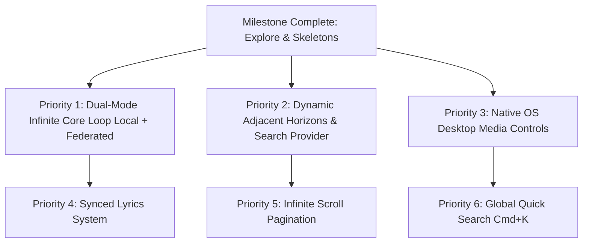

# Echo Music Player — Next Steps & Execution Roadmap

This document outlines the priority workstreams, architectural design requirements, and tracking milestones for upcoming development cycles of Echo Music Player.

---

## 🎯 Current Status & Recent Milestones

- [x] **Phase 1: Explore & Feed Overhaul**
  - [x] Modular aggregated Explore feed (Editorial Spotlight, Dynamic Categories, Trending, New Releases).
  - [x] Full categorized search (`Song`, `Album`, `Playlist`, `Artist`).
  - [x] YouTube Music `WEB_REMIX` provider integration with cached visitor tokens and BotGuard attestation.
  - [x] Generic output sanitization in WASM extension and host daemon to filter spam/ringtones and guarantee authentic studio releases.
  - [x] Centralized skeleton primitives and zero-CLS header placeholders across all Explore sections.
- [x] **Phase 2: Unified Collection Architecture & Liked Songs**
  - [x] Unified virtualized right drawer (`CollectionDetail.svelte`) replacing separate album/playlist views.
  - [x] Rich Artist profile pages (`ArtistDetail.svelte`) with top tracks, discography carousels, and subscriber stats.
  - [x] SQLite telemetry upsert for Liked Songs (`get_liked_songs`) with real-time UI synchronization across all views.
  - [x] Custom Obsidian-and-Brass visual identity for favorites.

---

## 🚀 Priority Roadmap & Workstreams

---

## 1. 📻 Priority 1: Dual-Mode Infinite Core Loop (Local Offline + Federated)
> **Goal:** Complete Echo’s core identity — *“Play any track → Queue automatically generates the next contextual track without interruption.”*

### Implementation Tasks
- [ ] **Local Markov Random Walk (Offline / Zero-Internet Mode):**
  - Query SQLite index for currently playing track's artist, album, genre, and duration tags.
  - Select next track using harmonic distance + strict **recency penalty** (exclude songs played in last 2 hours).
  - Works 100% offline out-of-the-box with any local library.
- [ ] **Daemon Queue Exhaustion Watcher:**
  - Hook into the dedicated audio thread's queue state to detect when the queue is 1 track away from empty.
- [ ] **WASM Federated Radio Dispatch (Online Mode):**
  - Pass the current seed (`artist`, `title`, `source_id`) to active sandboxed WASM provider (`get_radio` / `get_related`).
  - Seamlessly append resolved tracks to `audioStore.queue` without audio buffer glitching.
- [ ] **Autoplay Toggle in UI:**
  - Add explicit toggle in Player Bar and Queue Drawer (`Autoplay Radio: Local / Remote / Off`).

---

## 2. 🌌 Priority 2: Dynamic Adjacent Horizons & Default Search Provider
> **Goal:** Replace static mock horizons with a dynamic discovery engine powered by a default recommendation/search provider.

### Implementation Tasks
- [ ] **Default Recommendation/Search Provider:**
  - Ship a lightweight, clean recommendation provider to supply live, changing musical frontiers and genre tokens.
- [ ] **Dynamic Frontier Inversion:**
  - Inspect the user's dominant 7-day SQLite listening habits and dynamically pair them with distant, unlistened genres.
  - Fetch 3 real, live preview tracks dynamically (artwork, duration, IDs) instead of hardcoded structs.
- [ ] **Stream Resolution Bridge:**
  - When user clicks *"Play"* on a preview track or *"Explore Horizon"*:
    - If a streaming extension (`youtube-wasm`, etc.) is active $\rightarrow$ stream audio dynamically.
    - If a matching local file exists $\rightarrow$ play local lossless copy.
    - If offline with no extension $\rightarrow$ offer local style search or save discovery token.

---

## 3. 🎛️ Priority 3: Native Desktop Media Controls (MPRIS / SMTC / Souvlaki)
> **Goal:** Complete native desktop OS integration across Linux, Windows, and macOS.

### Implementation Tasks
- [ ] **Hardware Media Keys Integration:** Bind `Play/Pause`, `Next`, `Previous`, `Mute` to OS media controls via `souvlaki` crate.
- [ ] **OS Now-Playing Metadata Sync:** Feed current track title, artist, album, duration, playback position, and album art buffer to MPRIS (Linux D-Bus) / SMTC (Windows) / NowPlaying (macOS).
- [ ] **Tray Icon & Background Controls:** Add system tray minimization and quick-control menu.

---

## 4. 🎤 Priority 4: Synchronized / Timed Lyrics Experience
> **Goal:** High-fidelity, real-time lyrics synchronized with audio playback.

### Implementation Tasks
- [ ] **LRC Parser & Local Lyrics Support:** Support standard `.lrc` timestamped files in same directory as local tracks.
- [ ] **WASM Remote Lyrics Resolution:** Implement sandboxed `get_lyrics` hook for fetching synchronized lyric timestamps on remote tracks.
- [ ] **Dynamic Scrolling Lyrics Component:**
  - Active line highlighting with smooth spring interpolation in `<FullScreenPlayer>`.
  - Dedicated lyrics view / sidebar tab.
  - Click-to-seek by tapping on a lyric line.

---

## 5. 📜 Priority 5: Infinite Scroll Pagination (Explore & Search)
> **Goal:** Seamless catalog browsing depth without artificial limits.

### Implementation Tasks
- [ ] **Continuation Token Handler:** Consume `continuation_token` returned by `CategorizedSearchResult` and YouTube WASM browse endpoints.
- [ ] **Svelte Virtualizer Scroll Anchor:** Trigger next page chunk fetch when scroll position nears bottom of Explore feed or Search list.
- [ ] **Prefetch & Debounce:** Prefetch subsequent pages 300px before scroll boundary to eliminate loading pauses.

---

## 6. ⚡ Priority 6: Quick Command Palette (`Cmd+K` / `Ctrl+K`)
> **Goal:** Instant, keyboard-first navigation and player remote control.

### Implementation Tasks
- [ ] **Global Shortcut Listener:** Register `Ctrl+K` / `Cmd+K` global overlay hotkey.
- [ ] **Unified Fuzzy Search:** Instant fuzzy searching across local library, recent search history, artists, and remote catalog.
- [ ] **Action Shortcuts:** Fast commands (`/play`, `/shuffle`, `/liked`, `/queue`, `/clear`).

---

## 🛠️ Engineering Constraints & Guidelines (from `GEMINI.md`)
* **Audio Thread Isolation:** `rodio` sink and event loop must strictly live on a dedicated OS thread outside Tokio runtime.
* **No Tokio Blocking:** Wrap all SQLite calls in `tokio::task::spawn_blocking` or funnel through database actor channel.
* **IPC Bridge Hygiene:** Throttle high-frequency playback position events to $\le$ 4Hz; let frontend interpolate smoothly via `requestAnimationFrame`.
* **Zero UI Interfiltration:** Svelte 5 Runes exclusively (`$state`, `$derived`, `$effect`); avoid external bloated CSS frameworks.
