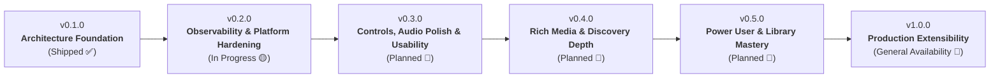

# Lyria Desktop — Version Release Scope & Roadmap

This document defines the release cadence, scope boundaries, and feature deliverables across Lyria's development milestones. Each version groups tightly-coupled capabilities across the Audio Engine, WASM Extension Sandbox, SQLite Data Layer, and SvelteKit Remote Interface.

---

## 🗺️ Release Cadence Overview

---

## 📦 Version 0.1.0 — Architecture Foundation & Extensibility
> **Status:** Shipped ✅  
> **Theme:** Robust foundational architecture: lock-free audio thread, sandboxed WASM extensions, and the infinite core playback loop.

### Deliverables
* **Audio Engine & Concurrency**:
  * Dedicated, non-blocking OS thread for `rodio` audio sink communicating via lock-free `mpsc` channels.
  * Synchronous SQLite isolation funneled through dedicated background database actor channels.
  * Playback position interpolation with throttled IPC updates ($\le$ 4Hz) to prevent bridge saturation.
* **Extism WASM Runtime**:
  * Embedded Extism WebAssembly sandbox with async HTTP (`reqwest`) and quickjs attestation capabilities.
  * Strict memory bounding, execution timeouts, and host logging pipelines.
  * YouTube WASM extension (`WEB_REMIX`) with dynamic BotGuard attestation and PO token minting.
* **Extension System & Import Engine**:
  * Standardized OS application paths (`Lyria/extensions`) with automatic migration from legacy paths.
  * 1-depth subdirectory manifest inspection (`manifest.json` / `extension.json`).
  * Non-blocking archive extraction with Zip Slip protection and safe directory copying via `spawn_blocking`.
  * Remote management UI with solid import dropdown, drag-and-drop overlay (zero layout shift), extension descriptions, and toast notifications.
* **Core Playback Loop**:
  * Dual-mode infinite core loop: Local Markov random walk (offline mode via tag distance and 2-hour recency penalty) and federated WASM radio replenishment (`get_radio`).
  * Autoplay radio toggle (`Local / Remote / Off`).
* **Catalog Exploration & Desktop Integration**:
  * Aggregated Explore feed (spotlights, categories, trending, new releases) and categorized search.
  * Native OS media controls via `souvlaki` (MPRIS on Linux, SMTC on Windows, hardware keys, Now-Playing sync).
  * Unified virtualized collection drawer (`CollectionDetail.svelte`) and real-time Liked Songs telemetry.

---

## 🔍 Version 0.2.0 — Observability, Diagnostics & Platform Hardening
> **Status:** In Progress 🟡  
> **Theme:** Complete runtime observability across all four execution tiers, introduce the standalone Real-Time Debug Console, and harden cross-distribution Linux packaging.

### Scope & Deliverables
* **Real-Time Debug Console (`/debug`)**:
  * Dedicated standalone debug window with live 2Hz batch streaming from background ring buffer.
  * Unified 4-tier log aggregation:
    * *Rust Backend*: Custom `tracing_subscriber::Layer` (`BufferLogLayer`) capturing engine, database, and audio thread events.
    * *WASM Plugins*: Extism `host_log` bridge forwarding extension logs directly under `WASM`.
    * *SvelteKit Frontend*: Non-blocking, recursion-safe telemetry hook in `app.html` forwarding `console.warn`, `console.error`, and uncaught window errors.
    * *JS Execution Sandbox*: VM evaluation lifecycle telemetry, script execution timeouts, and CSP violation logging.
  * Color-coded origin badge chips (Frontend, Backend, WASM, JS Sandbox, Audio, Database, Network, System).
  * High-visibility severity formatting (crimson background wash and left-accent border for `ERROR`, warm amber for `WARN`).
  * Telemetry control tools: live pause/resume, search query filtering, category filters, auto-scrolling, buffer clear, and formatted clipboard copy.
  * Silent terminal by default: Raw terminal stdout printing muted, gated behind `RUST_LOG_STDOUT=1`.
  * Discarded legacy `#debug-overlay` in `app.html`.
* **Universal AppImage Packaging Hardening**:
  * Automated CI post-build sanitization pipeline in `release.yml`.
  * Unpacks AppImage, scrubs host-conflicting display and driver libraries (`libwayland*.so*`, `libEGL*.so*`, `libGL*.so*`, `libgbm*.so*`, `libdrm*.so*`), and repacks with `appimagetool`.
  * Guarantees seamless Wayland EGL display negotiation without `EGL_BAD_PARAMETER` aborts.
* **Targeted Fixes**:
  * Fix duplicate album display when liking/favoriting a local album.
  * Replace hardcoded `'youtube-wasm'` fallbacks with user's configured default provider.

---

## 🎯 Version 0.3.0 — Context Controls, Audio Polish & Usability
> **Status:** Planned 🔵  
> **Theme:** Complete primary desktop playback usability with contextual action menus, volume/playback fidelity, and desktop integration.

### Scope & Deliverables
* **Context Menus & Action Controls**:
  * Global custom right-click context menu across tracks, albums, artists, playlists, and queue.
  * 3-dot options button (`DotsThreeVertical`) on TrackRow, AlbumCard, and QueueSidebar:
    * *Play Next*
    * *Add to Queue*
    * *Add to Playlist* (with sub-menu picker)
    * *Go to Album / Go to Artist*
    * *Toggle Like / Favorite*
    * *Show in File Explorer* (for local tracks)
    * *Remove from Queue* (queue-specific action)
* **Audio Engine Polish**:
  * Gapless playback and configurable crossfade (1–5s) between consecutive tracks.
  * ReplayGain / volume normalization (EBU R128 / LUFS standard) to prevent loudness jumps.
  * Sleep timer (stop playback after N minutes or at the end of the current track).
* **Desktop Polish**:
  * System tray integration with minimize-to-tray, close-to-tray, and playback context menu.
* **Command Palette Expansion**:
  * Extend <kbd>Ctrl+K</kbd> / <kbd>Cmd+K</kbd> `GlobalSearch` with slash commands (`/play`, `/shuffle`, `/liked`, `/queue`, `/clear`).

---

## 🌌 Version 0.4.0 — Rich Media, Lyrics & Discovery Depth
> **Status:** Planned 🔵  
> **Theme:** High-fidelity synchronized lyrics, dynamic musical frontier discovery, and catalog browsing depth.

### Scope & Deliverables
* **Synchronized & Timed Lyrics System**:
  * Extension lyrics capability (`lyrics`): WASM export hook `get_lyrics`.
  * Real-time scrolling lyrics component with active line spring interpolation and click-to-seek in `<FullScreenPlayer>` and sidebar.
  * Local `.lrc` timestamped file parser and SQLite lyrics caching.
* **Dynamic Adjacent Horizons**:
  * Invert 7-day SQLite listening habits to dynamically pair unlistened musical genres with dominant artist styles.
  * Fetch 3 real, dynamic preview tracks (artwork, duration, IDs) with streaming/local fallbacks instead of static structs.
* **Infinite Scroll Pagination**:
  * Consume `continuation_token` returned by providers and browse endpoints.
  * Svelte Virtualizer scroll-boundary prefetching (~300px before edge) for Explore feed and Search results.
* **Audio Fidelity Badges**:
  * Visual format and quality badging (FLAC 24-bit/96kHz, MP3 320kbps, OPUS) on tracks and player bar.
* **Extension Priorities & Fallbacks**:
  * User-governed extension priority ordering in Settings.
  * Multi-tier fallback resolution chain across extensions if primary provider cannot resolve a stream.

---

## 🛠️ Version 0.5.0 — Power User Workflows & Library Mastery
> **Status:** Planned 🔵  
> **Theme:** Specialized playback surfaces, automatic background indexing, and power user desktop integrations.

### Scope & Deliverables
* **Display Modes**:
  * Compact floating mini-player mode (always-on-top picture-in-picture widget with playback controls).
  * Immersive full-screen / cinematic view (ambient canvas background, high-res artwork, synced lyrics).
* **Library Management**:
  * Automatic filesystem watcher for music folders (background auto-indexing of newly added files without manual rescan).
  * Multi-select and batch actions (Shift/Ctrl-click to queue, add to playlist, or delete).
* **Hardware & OS Integrations**:
  * Audio output device selector in Settings (DAC, Bluetooth headphones, external speakers).
  * Discord Rich Presence integration (native or extension-driven, showing artwork, track, artist, elapsed time).
* **Branding & Visual Assets**:
  * Custom Lyria application icon generated across all desktop targets (32x32, 512x512, Windows `.ico`, macOS `.icns`).

---

## 🚀 Version 1.0.0 — Production Extensibility & General Availability
> **Status:** Planned 🔵  
> **Theme:** Production stability, advanced DSP audio algorithms, and full extension authoring capabilities.

### Scope & Deliverables
* **Equalizer & DSP**:
  * Native biquad filter DSP engine on the audio thread.
  * Extension equalizer profiles (`equalizer` capability) with customizable frequency bands and curve definitions.
* **Native Download Manager**:
  * Asynchronous background download engine with chunking, retry support, and extension stream resolution.
  * Automatic metadata tagging (ID3, Vorbis, embedded artwork) and automatic indexing into local database.
* **Extension Lifecycle & Scrobbling**:
  * Playback lifecycle hooks (`start`, `pause`, `progress_50`, `complete`) dispatched to extensions.
  * Support for Last.fm, ListenBrainz, and external scrobblers via extension ecosystem.
* **Metadata Scraper Capability**:
  * Extension hooks (`get_artist_info`, `get_album_info`) to render native artist biography and discography inspection sheet.
* **Extension Themes**:
  * Support theme packages with CSS variable overrides and custom color palettes.
* **Release Engineering & Packaging**:
  * Automated signed multi-platform binary releases: Linux (AppImage, deb, rpm), Windows (MSI/exe), macOS (DMG).
