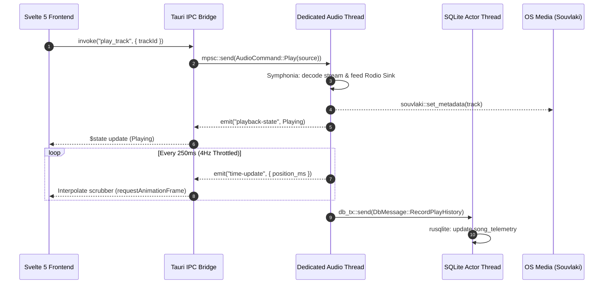

# Lyria System Architecture Specification

Version: 1.0  
Status: Canonical  
Last Updated: 2026-09-11  

---

# 1. Overview: The System Topology (The What)

Lyria is a minimal, algorithmically-driven local and federated desktop audio player.

**Federated Audio Catalog:** Lyria unifies local offline audio files (FLAC, MP3, WAV, OGG, OPUS) and remote streaming WebAssembly extensions (YouTube, SoundCloud, Bandcamp) into a single, seamless playback catalog with identical queueing, telemetry, volume normalization, and audio processing semantics.

The application architecture strictly separates **UI presentation** from **audio processing and state management**:
* **Frontend (The Remote Control):** SvelteKit (SPA Mode), Svelte 5 (Runes exclusively: `$state`, `$derived`, `$effect`), TypeScript, and Vite. The frontend possesses zero local state persistence; it acts purely as a real-time remote control for the Rust backend.
* **Backend (The Core Engine):** Rust and Tauri 2.0. Manages the audio output pipeline, SQLite database actor, sandboxed WebAssembly extensions, and native OS desktop integrations.

```
┌────────────────────────────────────────────────────────────────────────────────────────┐
│                                FRONTEND (SvelteKit / Svelte 5 Runes)                    │
│     PlayerBar  │  TrackRow  │  AlbumGrid  │  CollectionDetail  │  GlobalSearch         │
└───────────────────────────────────────────┬────────────────────────────────────────────┘
                                            │ Tauri 2.0 IPC (Throttled <= 4Hz)
                                            ▼
┌────────────────────────────────────────────────────────────────────────────────────────┐
│                              TAURI 2.0 COMMAND LAYER & TOKIO RUNTIME                   │
│          App State  │  Feature Flags  │  Async HTTP (Reqwest)  │  Logging Ring Buffer  │
└───────┬───────────────────────────────────┬────────────────────────────────────┬───────┘
        │ Lock-free mpsc                    │ Actor Channel (db_tx)              │ Sandboxed Calls
        ▼                                   ▼                                    ▼
┌───────────────────────────┐   ┌───────────────────────────┐   ┌────────────────────────┐
│    DEDICATED AUDIO OS     │   │   DEDICATED SQLITE ACTOR  │   │   SANDBOXED EXTISM     │
│          THREAD           │   │          THREAD           │   │      WASM RUNTIME      │
│  - Rodio Sink             │   │  - Synchronous rusqlite   │   │  - Memory bounded      │
│  - Symphonia Decoders     │   │  - Single-writer queue    │   │  - 3500ms timeout      │
│  - FLAC/MP3/WAV/OGG/OPUS  │   │  - WAL mode concurrency   │   │  - Async HTTP host fns │
│  - Gapless buffer feed    │   │  - Telemetry & playlists  │   │  - Sandbox-VM JS bridge│
└───────────────────────────┘   └───────────────────────────┘   └────────────────────────┘
```

---

# 2. Problem Statement & Motivation (The Why)

Traditional desktop music players (Electron wrappers or heavy browser-based frameworks) suffer from three fatal flaws:
1. **Excessive Resource Consumption:** Idle memory footprints commonly range between 300MB and 1GB of RAM, with high background CPU wakeups.
2. **Audio Stuttering Under UI Load:** When decoding or playback lives inside the same JavaScript or async event loop as network I/O and DOM rendering, heavy operations (such as importing a 10,000-track folder or rendering a collection grid) cause audible micro-stutters and buffer underruns.
3. **Unsafe Plugin Execution:** Native C-ABI plugin models (`.so` / `.dll`) grant foreign code unconstrained access to host memory, risking application crashes, memory corruption, and security breaches.

Lyria was engineered to deliver **audiophile-grade playback fidelity** with a minimal resident memory footprint (empirically benchmarked and verified via [`scripts/benchmark-memory.sh`](../../scripts/benchmark-memory.sh)), sub-400ms cold startup, and process-level WebAssembly memory sandboxing with strict linear allocation bounds.

---

# 3. Architectural Decisions & Trade-Offs (The Reasoning)

### 3.1. SvelteKit + Tauri 2.0 vs. Electron
* **Decision:** Reject Electron in favor of Tauri 2.0 backed by native OS WebViews (WebKitGTK on Linux, WebView2 on Windows, WebKit on macOS) with Svelte 5.
* **Reasoning:** Eliminates bundling an entire Chromium binary. Svelte 5's fine-grained runes eliminate the virtual DOM overhead, reducing frontend runtime memory from ~150MB to ~15MB.
* **Trade-Off:** Requires careful cross-platform CSS/JS validation to account for differences between WebKitGTK and Chromium rendering engines.

### 3.2. Dedicated Audio OS Thread vs. Tokio Async Tasks
* **Decision:** The `rodio` sink and Symphonia audio decoder event loop live on a dedicated OS thread completely outside the Tokio async runtime.
* **Reasoning:** Audio buffer feeding requires deterministic, sub-millisecond real-time scheduling. Tokio's cooperative work-stealing thread pool can be preempted or delayed by sudden bursts of async network requests, disk I/O, or JSON deserialization. An isolated OS thread ensures zero buffer underruns regardless of system load.
* **Trade-Off:** All communication between Tokio async commands and the audio engine must cross a lock-free `mpsc` message-passing channel (`audio_tx`), requiring explicit state synchronization.

### 3.3. SQLite Single-Writer Actor Channel & WAL Concurrency
* **Decision:** All database mutations are funneled through a single-writer actor channel (`state.db_tx`) on a dedicated background thread, combined with SQLite Write-Ahead Logging (`PRAGMA journal_mode = WAL;`) and busy timeout (`PRAGMA busy_timeout = 5000;`).
* **Reasoning:** SQLite locks the database file during write transactions. If multiple concurrent Tokio tasks attempt simultaneous writes (e.g. background library scanning alongside playback telemetry logging), threads encounter `SQLITE_BUSY` contention. The actor channel serializes writes sequentially, while WAL mode allows concurrent reader connections (`open_read_conn`) to query without blocking on active write transactions.
* **Trade-Off:** Queries requiring synchronous return values must supply a one-shot `oneshot::channel` to await the actor's response.

### 3.4. Extism WebAssembly Sandbox with Headless Webview JS Bridge
* **Decision:** Third-party extensions are compiled ahead-of-time to WebAssembly and executed within sandboxed Extism runtime modules. When dynamic JavaScript evaluation is required (e.g. cipher de-obfuscation or streaming token generation), guest WASM calls the host function `host_execute_webview_js`, which dispatches the script into an isolated, headless Tauri Webview window (`sandbox-vm` loading `sandbox.html`).
* **Reasoning:** A rogue or buggy provider script must never compromise host application stability, access host memory, or escape its linear memory bounds. Sandboxing extensions in Extism isolates CPU execution and memory. Offloading JavaScript execution to a dedicated headless Webview window avoids embedding an unconstrained JS engine inside the Rust binary.
* **Trade-Off:** Boundary crossing between the WASM guest, Rust host, and headless Webview introduces micro-latency for script evaluation, which Lyria mitigates via token caching and asynchronous execution.

---

# 4. End-to-End Playback Data Flow (The How)

The typical lifecycle of a playback request:



1. **User Action:** The listener triggers playback from `TrackRow.svelte` or `AlbumCard.svelte`.
2. **IPC Dispatch:** Svelte dispatches the `play_track` command over Tauri IPC.
3. **Audio Message Passing:** The Tauri handler emits an `AudioCommand::Play` message into the lock-free `audio_tx` channel.
4. **Decoding & Sink Feed:** The dedicated audio thread receives the command, spins up a Symphonia decoder, and feeds continuous PCM buffers to the `rodio` output sink:
   * **Local Audio:** Decoded directly from filesystem streams via Symphonia's `MediaSourceStream`.
   * **Network Streams:** Buffered asynchronously using the `stream-download` crate (`HttpStream`), which fetches remote HTTP chunks in the background while exposing a synchronous, seekable `Read + Seek` interface wrapped in `StreamMediaSource<T>`. This satisfies Symphonia's `MediaSource` trait without blocking or stalling the dedicated audio thread.
5. **Gapless Audio Handoff:** Continuous playback across track boundaries is managed by `TrackedSource` wrapping the active decoder. When the current track reaches EOF, `TrackedSource` triggers an internal `advance_tx` event that dequeues the pre-loaded next track directly into the running `rodio` sink without tearing down or re-initializing the OS audio hardware stream.
6. **OS Sync:** The audio thread updates native OS media controls via `souvlaki` (MPRIS on Linux, SMTC on Windows, NowPlaying on macOS).
7. **Throttled Telemetry:** Playback position updates are emitted across IPC at a maximum frequency of $4Hz$. The frontend interpolates smooth 60fps/120fps progress using `requestAnimationFrame`.
8. **Telemetry Persistence:** Upon reaching the playback threshold, a play event is funneled to `db_tx` to update local statistics.

---

# 5. Failure Modes & Recovery Strategies

| Subsystem | Potential Failure | Recovery & Mitigation Strategy |
| :--- | :--- | :--- |
| **Audio Engine** | Audio output hardware disconnected (e.g. headphones unplugged). | `rodio` sink detects device drop; audio thread catches disconnection, transitions state to `Paused`, and notifies frontend via IPC without crashing. |
| **Audio Decoders** | Corrupted audio file header or unsupported codec. | Symphonia returns a decode error; the engine logs the failure to the ring buffer, skips gracefully to the next queue item, and posts a warning toast. |
| **Database** | Concurrent reads and writes during heavy background library scans. | Write operations are serialized through the in-memory actor channel (`db_tx`); WAL mode (`PRAGMA journal_mode = WAL;`) and a 5000ms busy timeout prevent concurrent reader connections from receiving `SQLITE_BUSY`. |
| **WASM Stream Resolvers** | Stream resolution extension hangs or times out ($3500ms). | Extism execution timeout terminates the guest VM; the engine logs a sandbox timeout error, skips to the next configured stream provider in the priority chain, and renders a non-blocking warning toast if all fail. |
| **WASM Search / Catalog** | Search provider extension fails or returns malformed data. | Extism isolates the crash; the provider is omitted from the aggregated search feed without failing the overall search request. |
| **WASM Radio / Autoplay** | Remote radio provider extension hangs or fails. | Extism terminates the execution and falls back to local library heuristic candidate scoring (artist affinity, play count bonus, 120m recency exclusion). |
| **Network Streaming** | Network jitter, dropped connection, or slow HTTP stream chunking. | `stream-download` manages background chunk retries and ring-buffering; if a read times out, the audio thread pauses decoding cleanly rather than panicking. |
| **IPC Bridge** | Rapid playback scrubbing or slider spam floods the bridge. | Seek and volume commands are debounced in the frontend; continuous playback telemetry is capped at $4Hz$. |

---

# 6. System Invariants & Non-Negotiable Guardrails

To prevent architectural degradation, all contributors and agents must uphold these rules:

1. **No Tokio Blocking:** `rusqlite` operations are strictly synchronous. **NEVER** execute database queries directly inside `async` Tauri commands. Always funnel writes through `state.db_tx` or wrap isolated synchronous queries in `tokio::task::spawn_blocking`.
2. **Audio Thread Isolation:** The `rodio` audio sink and decoding loop must remain on a dedicated OS thread outside Tokio. Mutation must occur exclusively via lock-free `mpsc` message passing.
3. **Throttled Telemetry ($\le 4	ext{Hz}$):** Never stream high-frequency time updates across Tauri IPC. High-frequency interpolation belongs in the Svelte frontend via `requestAnimationFrame`.
4. **Zero UI Interfiltration:** The frontend is strictly a remote control. Heavy animation libraries and massive state stores are forbidden.
5. **Primitive Marshalling:** Never stream massive raw database vectors across IPC. Always paginate and serialize into concise primitive payloads.
6. **Memory Budget Gating:** The application steady-state memory footprint is continuously guarded by empirical time-series benchmarking (`./scripts/benchmark-memory.sh --quick`). Host daemon anonymous memory (`RssAnon`) must remain within the thresholds specified in `benchmarks/thresholds.json` ($\le 25\text{MB}$ idle, $\le 5\text{MB}$ post-playback leak delta).

---

# 7. Verification & Quality Gates

Every architectural modification must be verified using the automated test suite:

```bash
# 1. Backend Linting & Warning Check
cargo clippy --all-targets -- -D warnings

# 2. Backend Unit & Concurrency Tests
cargo test

# 3. Binary Footprint Inspection
size target/release/lyria

# 4. Memory & Performance Benchmark Suite
./scripts/benchmark-memory.sh --quick

# 5. Frontend Type Checking
bun run check

# 6. Frontend Component Unit Tests
bun test
```

---

# 8. Subsystem Architecture Map

For detailed deep-dives into each individual component, refer to the canonical subsystem specifications:

* [Audio Engine & Decoders](./audio-engine.md) — Lock-free `rodio` sink, Symphonia decoders, and threading.
* [Database & Storage Architecture](./database.md) — SQLite actor pattern, schema migrations, and canonical keys.
* [Queue State Machine & Invariants](./queue-system.md) — Atomic queue mutations, shuffle preservation, and test matrix.
* [Infinite Core Loop & Autoplay](./core-loop.md) — Dual-tier recommendation heuristics and WASM radio replenishment.
* [Discovery Subsystems](./discovery.md) — Editorial Spotlight hero carousel and Adjacent Horizons Detour engine.
* [Observability & Diagnostic Pipeline](./observability.md) — 4-tier logger, `/debug` route, and muted stdout policy.
* [OS Integration & Packaging](./os-integration.md) — Desktop media controls (`souvlaki`) and cross-platform packaging.

---

# 9. Memory Budget & Benchmarking Suite

Lyria includes an empirical, reproducible benchmarking harness (`scripts/benchmark-memory.sh` / `scripts/benchmark_memory.py`) specifically tailored for developer workstations. The harness tracks detailed memory breakdowns (`VmRSS`, `RssAnon`, `RssFile`, `PSS`), CPU consumption per-thread, thread counts, file descriptors, and temporary file usage across key lifecycle states.

### 9.1. Lifecycle Benchmark Scenarios

* **S1: Cold Idle:** Ground-truth quiescent memory footprint after window & WebKit initialization.
* **S2: Library Scan:** Memory and CPU impact of background directory scanning and SQLite bulk insertion.
* **S3: Post-Scan Idle:** Verification of memory reclamation after library scanning.
* **S4: Local Playback:** Steady-state decoding, ring buffer usage, and rubato resampling CPU load.
* **S5: MP3 Playback:** Codec comparison against lossless formats.
* **S6: Rapid Skip Stress:** Rapid track switching (20 tracks in 30s) testing decoder thread cleanup and `Drop` semantics.
* **S7 / S8: Post-Playback Settled (Leak Detection Gate):** Verifies all decoder threads terminate, temporary files are removed, and heap growth returns within $\le 5\text{MB}$ of baseline.

### 9.2. Advisory Environment Confidence

The benchmark suite never alters the host system. Instead, it inspects pre-run system conditions (CPU scaling governor, page caches, competing media players, release build profile, swap pressure, and PSS accessibility) and tags each benchmark report with a confidence grade (`CONTROLLED` vs. `DEGRADED`).

### 9.3. Running the Benchmark

```bash
# 1. Quick developer feedback loop (~2 min: S1 Cold Idle -> S4 Playback -> S7 Leak Gate)
./scripts/benchmark-memory.sh --quick

# 2. Attach to an already running instance for live ANSI dashboard
./scripts/benchmark-memory.sh --watch

# 3. Establish a local baseline on your machine
./scripts/benchmark-memory.sh --quick --save-baseline

# 4. Compare a new build against your baseline
./scripts/benchmark-memory.sh --quick --compare benchmarks/baseline.json

# 5. Long-soak endurance test (60 minutes with linear regression leak detection)
./scripts/benchmark-memory.sh --long-soak --duration 3600
```

### 9.4. Advisory Regression Thresholds

Key thresholds configured in `benchmarks/thresholds.json`:

| Metric | Target / Threshold | Description |
| :--- | :---: | :--- |
| **Host Idle Anon (`RssAnon`)** | $\le 25.0\text{ MB}$ | Pure heap/stack allocation of the Rust daemon. |
| **Total Idle PSS** | $\le 120.0\text{ MB}$ | Full proportional physical memory (Host + WebKit). |
| **Audio Thread CPU** | $\le 5.0\%$ | Dedicated audio thread consumption during playback. |
| **Post-Playback Leak Delta** | $\le 5.0\text{ MB}$ | Memory retained after stopping playback. |
| **Thread Count Delta** | $\le 0$ threads | Guarantee no orphaned decoder or seek threads. |
| **File Descriptor Delta** | $\le +3$ FDs | Guarantee no socket or SQLite file descriptor leaks. |
| **Temporary File Cleanup** | $0.0\text{ MB}$ | All `/tmp/stream-download-*` files cleaned up. |
