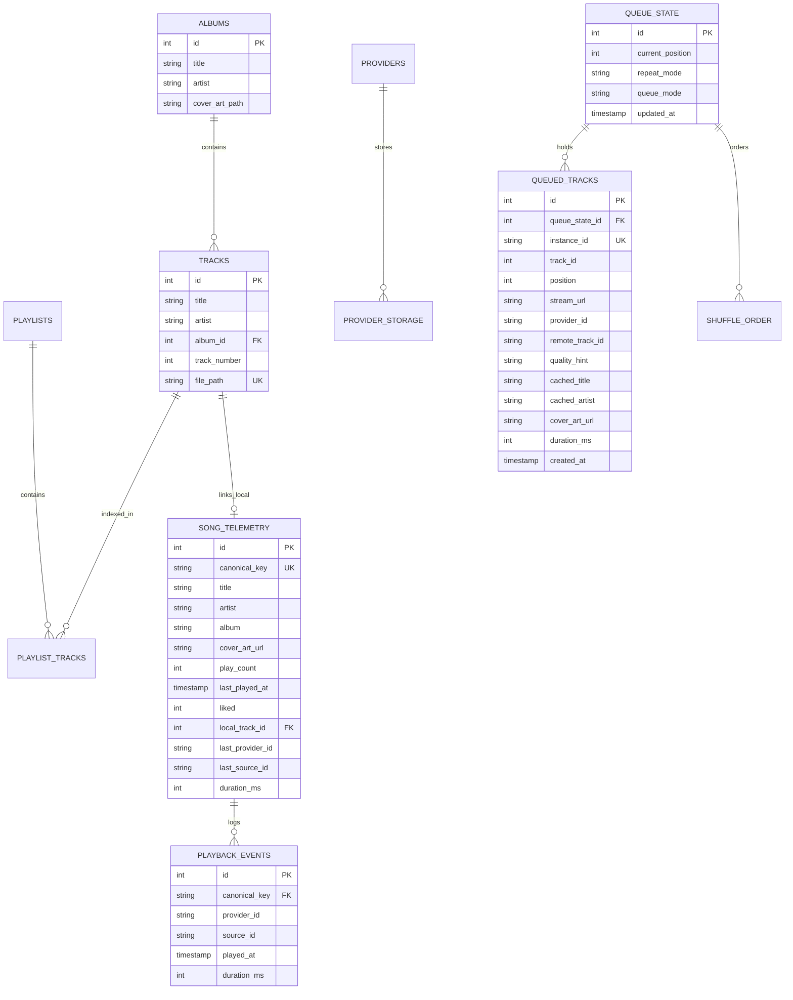

# Database & Storage Architecture

Version: 1.0  
Status: Canonical  
Last Updated: 2026-09-13  
Source Module: [`src-tauri/src/db/`](../../src-tauri/src/db/)

---

# 1. Overview: The Subsystem Topology (The What)

Lyria employs an embedded **SQLite** database engine via `rusqlite`, managed through a **Single-Writer / Multi-Reader Actor Architecture**.

The database persists local library metadata, queue state snapshots, playback telemetry, extension storage, and the canonical deduplication graph. It is physically located in the user's data directory at `Lyria/database/echo_library.db` (reflecting legacy workspace naming from `echo-desktop`).

```
┌──────────────────────────────────────────────────────────────────────────────────────────────────┐
│                                   TAURI COMMAND LAYER & TOKIO RUNTIME                            │
│  - Playback Telemetry              - Library Directory Scanner        - Extension Resolvers      │
│  - Queue Mutations                 - Explore Feed Compilation         - Settings & Preferences   │
└───────────────────┬──────────────────────────────────────────────────────────────┬───────────────┘
                    │                                                              │
                    │ std::sync::mpsc::Sender<DbRequest>                           │ open_read_conn()
                    │ (Single-Writer Serialization)                                │ (Concurrent Readers)
                    ▼                                                              ▼
┌──────────────────────────────────────────────┐                ┌──────────────────────────────────┐
│           DEDICATED DB ACTOR THREAD          │                │      READ-ONLY CONNECTIONS       │
│      src-tauri/src/db/mod.rs: start_db_thread│                │  rusqlite::OpenFlags:            │
│                                              │                │  SQLITE_OPEN_READ_ONLY |         │
│  ┌────────────────────────────────────────┐  │                │  SQLITE_OPEN_NO_MUTEX            │
│  │       Sequential Request Loop          │  │                │  PRAGMA query_only = ON;         │
│  │ - Batch library indexing               │  │                └─────────────────┬────────────────┘
│  │ - Telemetry & play counts              │  │                                  │
│  │ - Settings & Provider sync             │  │                                  │
│  │ - oneshot::Sender response routing     │  │                                  │
│  └───────────────────┬────────────────────┘  │                                  │
└──────────────────────┼───────────────────────┘                                  │
                       │ Exclusive Write Access                                   │ Non-Blocking Read Access
                       ▼                                                          ▼
┌──────────────────────────────────────────────────────────────────────────────────────────────────┐
│                                   SQLITE DATABASE ENGINE                                         │
│                      PRAGMA foreign_keys = ON;  │  (WAL mode & busy_timeout planned)             │
│                                                                                                  │
│   ┌────────────────────────┐  ┌─────────────────────────┐  ┌──────────────────────────────────┐  │
│   │     Local Library      │  │     Federation Graph    │  │       Queue & Personalization    │  │
│   │ - tracks               │  │ - song_telemetry        │  │ - queue_state                    │  │
│   │ - albums               │  │ - playback_events       │  │ - queued_tracks                  │  │
│   │ - playlists            │  │ - extension_metrics     │  │ - shuffle_order                  │  │
│   │ - playlist_tracks      │  │ - recommendation_cache  │  │ - settings                       │  │
│   └────────────────────────┘  └─────────────────────────┘  └──────────────────────────────────┘  │
└──────────────────────────────────────────────────────────────────────────────────────────────────┘
```

### Core Responsibilities
1. **Single-Writer Serialization:** Core user-facing write transactions (track insertions, playlist modifications, play counts, settings mutations) funnel through a dedicated actor thread (`db_tx`), eliminating `SQLITE_BUSY` concurrency deadlocks. Extension recommendation caching and metrics currently use dedicated connection writes (tracked in [`docs/TODO.md`](../TODO.md) for actor unification).
2. **Concurrent Read Isolation:** Recommendation compiler query paths (`open_read_conn`) read directly from SQLite with read-only flags and `PRAGMA query_only = ON;`. Standard UI library queries currently route through the actor channel (concurrent read-connection pooling tracked in [`docs/TODO.md`](../TODO.md)).
3. **Canonical Normalization & Deduplication:** Generates deterministic canonical fingerprints (`clean_artist::clean_title`) to aggregate local files and remote streaming providers into a unified catalog.
4. **Queue & Session Persistence:** Schema definitions (`queue_state`, `queued_tracks`, `shuffle_order`) and cold-start recovery logic ensure queue state can be restored on startup; active runtime debounced queue snapshotting is tracked in [`docs/TODO.md`](../TODO.md).
5. **Extension Sandboxing Storage:** Key-value storage isolation for WASM plugins (`provider_storage`), preventing extensions from corrupting core library tables.

---

# 2. Motivation & Concurrency Constraints (The Why)

### 2.1. The Tokio Thread Blocking Anti-Pattern
SQLite through `rusqlite` executes synchronous C-ABI filesystem syscalls (`read`, `write`, `fdatasync`). In an `async` desktop application:
* **The Danger:** If database queries are executed directly inside `async fn` Tauri command handlers, the calling thread blocks synchronously on disk I/O.
* **The Impact:** Tokio's worker thread pool becomes starved. High-throughput operations (such as importing 10,000 tracks or searching large collections) delay unrelated asynchronous tasks (network stream chunking, IPC heartbeats, UI event handling), resulting in UI stutter and audible playback underruns.

### 2.2. Writer-Writer & Reader-Writer Lock Contention
SQLite operates with file-level database locking:
* **Writer-Writer Contention:** If multiple concurrent Tokio threads attempt simultaneous writes (e.g. background library scanning alongside real-time playback telemetry), SQLite returns `SQLITE_BUSY` errors.
* **Reader-Writer Contention:** Under standard rollback journal mode (`journal_mode = DELETE`), a write transaction acquires an exclusive lock on the database file, blocking all reader queries until the transaction commits.

---

# 3. Architectural Decisions & Trade-Offs (The Reasoning)

### 3.1. Dedicated Database Actor (`db_tx`) vs. Shared `Arc<Mutex<Connection>>`
* **Decision:** Database mutations are funneled through an unbounded `std::sync::mpsc::channel` (`DbRequest`) handled by a single OS thread (`start_db_thread`). Queries requiring return values provide a `tokio::sync::oneshot::channel` response handle.
* **Reasoning:** 
  * Wrapping a SQLite connection in `Arc<Mutex<Connection>>` forces Tokio worker threads to block while waiting for the mutex lock. Under heavy write load, mutex contention escalates rapidly.
  * Funneling writes through a sequential actor thread guarantees strictly serialized write execution. No thread ever waits on a mutex lock; tasks asynchronously dispatch commands and optionally await their oneshot response.
  * Using standard library `std::sync::mpsc` rather than a Tokio channel allows non-Tokio background threads (such as the dedicated audio decoding thread in [`src-tauri/src/audio/mod.rs`](../../src-tauri/src/audio/mod.rs)) to synchronously dispatch database requests without needing a Tokio runtime handle.
* **Trade-Off:** Requires defining explicit message variants in the `DbRequest` enum for every write operation, introducing slight boilerplate compared to raw query execution.

### 3.2. Write-Ahead Logging (WAL) Concurrency
* **Target Architecture:** The SQLite database is designed to operate with `PRAGMA journal_mode = WAL;` and `PRAGMA busy_timeout = 5000;`.
* **Reasoning:** 
  * While the actor pattern completely resolves *writer-writer* contention, it does not prevent *readers* (such as the recommendation engine compiling explore feeds) from being blocked during lengthy write transactions (such as bulk library scans) under standard rollback journal mode (`DELETE`).
  * WAL mode decouples readers from writers: write operations append sequentially to the `.db-wal` file while readers continue reading uninterrupted from consistent snapshot pages in the main `.db` file.
* **Implementation Status:** Currently, `init_db` initializes SQLite with `PRAGMA foreign_keys = ON;` in default journal mode. Activation of WAL mode and busy timeout is tracked in [`docs/TODO.md`](../TODO.md).
* **Trade-Off:** WAL mode maintains two auxiliary files (`.db-wal` and `.db-shm`), requiring periodic checkpointing (`PRAGMA wal_autocheckpoint = 1000;`).

### 3.3. Canonical Fingerprinting & Gaussian Deduplication
* **Decision:** Rather than relying on fragile metadata IDs or arbitrary strings, Lyria indexes all tracks by a normalized `canonical_key` (`artist::title`), augmented by a continuous Gaussian multi-attribute deduplication confidence engine ([`src-tauri/src/db/canonical.rs`](file:///home/ritwikg/Repository/echo-desktop/src-tauri/src/db/canonical.rs)).
* **Reasoning:** 
  * Streaming providers and local files format metadata inconsistently (e.g. *"Never Gonna Give You Up (Official Music Video)"* vs *"Never Gonna Give You Up [Remastered]"* vs *"Rick Astley - Topic"*).
  * Canonical normalization strips diacritics (Unicode NFKC), cleans noise patterns, extracts featured artists, and evaluates a multi-factor confidence score:
    $$\text{Confidence} = 0.50 \cdot \text{Sim}_{\text{title}} + 0.30 \cdot \text{Sim}_{\text{artist}} + 0.20 \cdot e^{-0.5 \left(\frac{\Delta \text{sec}}{10}\right)^2}$$
* **Trade-Off:** String normalization and Sørensen-Dice similarity calculations incur micro-processing overhead during library ingestion, which is batched to maintain sub-second scan speeds.

---

# 4. Implementation Details & Schema (The How)

### 4.1. Entity-Relationship Schema



> [!NOTE]
> In `PLAYBACK_EVENTS`, `canonical_key` acts as a logical reference to `SONG_TELEMETRY(canonical_key)` rather than a strict SQL foreign key constraint, allowing event recording prior to telemetry row initialization.

#### Auxiliary Schema Tables
In addition to the primary entity graph above, the schema defines tables for configuration, caching, and extension sandboxing:
* **Extensions & Capabilities:** `providers` (metadata, status, settings, priority) and `provider_storage` (isolated key-value store per extension).
* **Explore & Recommendations:** `recommendation_cache` (per-seed/per-provider shelf cache with 6-hour default TTL), `feed_cache` (24-hour editorial browse cache), and `artist_metadata` (cached avatars and bios).
* **Personalization & Deduplication:** `extension_metrics` (play counts, resolution latency, consecutive failures, backoff timestamps) and `dedup_overrides` (order-invariant manual merge rules).
* **Application State & Flags:** `settings` (persistent key-value store), `feature_flags` (runtime experiment toggles), `shuffle_order` (deterministic shuffle permutation seeds), `queue_history`, and `queue_snapshots`.

---

### 4.2. The Database Actor Protocol (`DbRequest`)

The actor thread executes a blocking loop over `Receiver<DbRequest>`. For queries returning results, the actor fulfills the caller's oneshot sender:

```rust
// Example: Asynchronous write dispatch from Tokio command
let (tx, rx) = tokio::sync::oneshot::channel();
state.db_tx.send(DbRequest::RecordPlaybackEvent {
    title: track.title,
    artist: track.artist,
    album: track.album,
    cover_art_url: track.cover_art_url,
    provider_id: track.provider_id,
    source_id: track.source_id,
    duration_ms: track.duration_ms,
    resp: tx,
}).map_err(|e| e.to_string())?;

// Await response asynchronously without blocking Tokio worker thread
rx.await.map_err(|_| "DB actor dropped receiver".to_string())??;
```

---

### 4.3. Multi-Attribute Canonical Deduplication Pipeline

When a track is resolved from a remote provider or imported from local disk, it passes through the deduplication engine in [`src-tauri/src/db/canonical.rs`](file:///home/ritwikg/Repository/echo-desktop/src-tauri/src/db/canonical.rs):

1. **User Override Short-Circuit:** Checks the `dedup_overrides` table for order-invariant manual merges (`(canonical_key_a, canonical_key_b)`).
2. **ISRC Exact Match:** If both tracks contain non-empty International Standard Recording Codes (ISRC), an exact match yields immediate 100% confidence.
3. **Unicode NFKC & Diacritic Stripping:**
   * Converts characters to decomposed form (`NFD`), filters combining marks, and recomposes via `NFKC`.
   * Strips streaming artifacts: `(Official Video)`, `[Lyrics]`, `(feat. ...)`, `- Remastered`.
4. **Continuous Gaussian Scoring:**
   * Computes Sørensen-Dice string similarity for title ($50\%$) and artist ($30\%$).
   * Computes Gaussian duration decay ($20\%$):
     $$D = e^{-0.5 \cdot \left(\frac{|d_A - d_B|}{10\text{s}}\right)^2}$$
5. **Threshold Evaluation:** If total confidence $\ge 0.85$, the tracks are merged into a single `FederatedTrack` entry containing multiple playback sources (`Vec<TrackSourceInfo>`).

---

### 4.4. Recommendation Cache & Personalization Queries

The database layer serves as the engine for Lyria's algorithmic explore feeds:

* **Affinity Clustering:** Aggregates 7-day listening telemetry (`GetHeavyRotation7d`), unlistened library tracks (`GetCanonicalForgottenFavorites`), and time-of-day mood affinity filtering (`mood_affinity_clause`):
  * **Deep Focus:** Focuses on ambient/instrumental tracks and daytime listening patterns (`09:00 - 17:00`).
  * **Late Night Drift:** Selects introspective, low-tempo tracks and late-night patterns (`22:00 - 05:00`).
* **TTL-Keyed Cache (`recommendation_cache`):** Remote recommendation shelves fetched from WASM extensions are cached with configurable TTLs (default: 6 hours) keyed by `(seed_canonical_key, provider_id, shelf_type)`.

---

# 5. Database Concurrency & Failure Recovery Matrix

| Scenario | Potential Risk | Engineering Defense |
| :--- | :--- | :--- |
| **Concurrent Write Spike** | Batch library import runs while user likes songs and modifies settings. | Core writes are serialized sequentially in the `db_tx` queue. Direct compiler cache writes are being funneled to `db_tx` (tracked in `TODO.md`). |
| **Reader Contention** | User scrolls explore grid while background directory scan writes 5,000 tracks. | Dedicated read connections (`open_read_conn`) avoid writer locks; full WAL mode & read offloading are tracked in `TODO.md` to prevent query serialization. |
| **Crash Mid-Transaction** | Sudden power loss or process kill during database mutation. | SQLite atomic ACID transactions ensure incomplete transactions roll back cleanly upon restart. |
| **Actor Thread Panics** | Unhandled SQLite error causes actor thread termination. | All SQL executions in `queries.rs` return structured `Result<T, String>`. The actor catches errors and passes them back over the `oneshot` channel without panicking the thread. |
| **Schema Migration Drift** | User updates Lyria from an older release with missing columns. | `init_db` runs idempotent migrations (`CREATE TABLE IF NOT EXISTS`, `ALTER TABLE ... ADD COLUMN` guards) on startup before accepting commands. |

---

# 6. Verification & Automated Quality Gates

All database interactions are verified through automated test suites and benchmark scenarios:

```bash
# 1. Run Database Unit & Deduplication Tests
cargo test db::

# 2. Run Canonical Normalization Tests (Unicode, Diacritics, Gaussian Penalties)
cargo test canonical::

# 3. Verify Memory & Concurrency during Ingestion (Scenario S2 Library Scan)
./scripts/benchmark-memory.sh --quick

# 4. Verify SQLite Connection & Thread Invariants:
# - scan_peak_anon_mb <= 45.0MB (during bulk insert)
# - max_fd_count <= 128 (no leaked SQLite file descriptors)
# - settle_leak_anon_mb <= 5.0MB (full cache cooldown)
```
