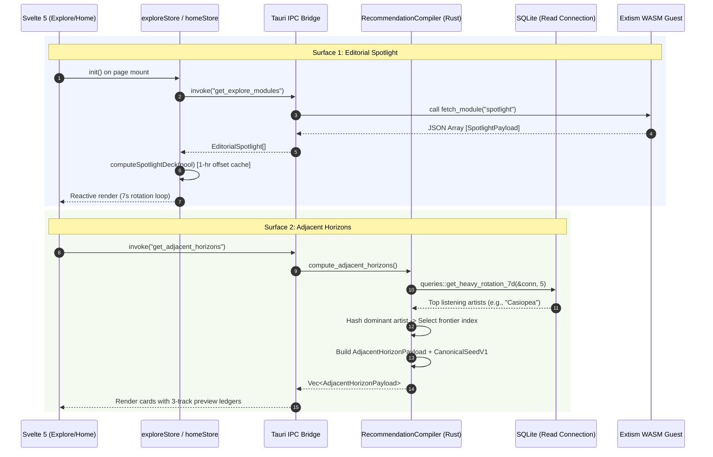

# Discovery Subsystem: Editorial Spotlight & Adjacent Horizons

This document specifies the architecture, algorithmic rationale, IPC contracts, and user experience paradigms governing discovery within Lyria. It details the **Editorial Spotlight** (curated hero showcase) and **Adjacent Horizons** (harmonic contrast and genre-inversion engine).

---

## 1. The What

The Discovery Subsystem is Lyria's dual-surface engine for curatorial presentation and serendipitous musical exploration. Rather than subjecting listeners to algorithmic echo chambers or infinite social feeds, Lyria structures discovery across two deliberate, tactile surfaces:

```
┌────────────────────────────────────────────────────────────────────────────────────────┐
│                                   DISCOVERY SURFACES                                   │
├───────────────────────────────────────────┬────────────────────────────────────────────┤
│           EDITORIAL SPOTLIGHT             │             ADJACENT HORIZONS              │
│          (Explore Surface `/explore`)     │           (Home Surface `/`)               │
├───────────────────────────────────────────┼────────────────────────────────────────────┤
│ • Widescreen ambient billboard (280px)    │ • Harmonic contrast & genre inversion deck │
│ • Sandboxed WASM provider showcases       │ • Local SQLite 7-day rotation profiling    │
│ • High-fidelity album & collection debuts │ • Curated frontier bridges (5 archetypes)  │
│ • 7-second auto-rotation with hover pause │ • Inline 3-track preview ledgers           │
│ • Zero-CLS skeleton placeholder           │ • One-click infinite federated radio launch│
│ • Dual-action playback & drawer dispatch  │ • Deterministic, client-side computation   │
└───────────────────────────────────────────┴────────────────────────────────────────────┘
```

### 1.1 Editorial Spotlight (Explore Hero Deck)
Situated at the crown of `/explore`, the Editorial Spotlight is an immersive narrative billboard ($280\text{px}$ container height) showcasing 1–6 premier releases, remaster editions, or curated collections:
* **Dynamic Ambient Light Backdrop**: Projects album artwork into an ultra-wide, heavily blurred gradient canvas using smooth cubic opacity transitions.
* **Typographic Hierarchy**: Features a subtle sparkling badge (`EDITORIAL SPOTLIGHT`), high-contrast serif/sans titles, artist provenance, and descriptive metadata tags (e.g., *"Featured Release • Lossless Master Edition"*).
* **Dual Action Controls**:
  * **Play Album**: Instantly loads the collection into the core playback engine and initiates streaming.
  * **Explore Release**: Slides open the right-hand collection drawer (`CollectionDetail.svelte`) displaying complete tracklists, durations, and publisher metadata without navigating away from the current browse context.
* **Auto-Rotating Carousel**: Advances slides every 7,000 milliseconds, smoothly pausing on pointer hover or active text search.

### 1.2 Adjacent Horizons (Harmonic Contrast Deck)
Embedded within the Home dashboard (`/`), Adjacent Horizons is a counter-algorithmic engine that inspects the listener's local play history to calculate complementary, unexplored musical territories:
* **Anti-Bubble Bridges**: Explicitly directs the listener away from their saturated genres toward stylistically compatible frontiers (e.g., bridging Indie Rock into *Analog Synthwave*, or Ambient Electronic into *Modern Japanese Jazz & Fusion*).
* **Curated 3-Track Preview Ledgers**: Presents immediate audio evidence of the proposed frontier with pre-resolved canonical track keys and album art.
* **Instant Radio Hand-off**: Selecting a frontier seed generates an on-the-fly seed packet (`CanonicalSeedV1`) dispatched to sandboxed WASM providers for infinite radio generation.

---

## 2. The Why

### The Tyranny of the Modern Filter Bubble
Mainstream streaming algorithms are engineered for maximum short-term session retention, optimizing for low cognitive load. This produces the **"Filter Bubble"**: recommender systems repeatedly suggest micro-variations of the same 3 to 5 artists the user streamed over the preceding 48 hours. The result is rapid listener fatigue, aesthetic stagnation, and an inability to organically explore new genres.

### The Philosophy of Curated Serendipity
True serendipity is not uniform randomness. Pure random shuffling across millions of tracks yields jarring, unpleasant transitions that trigger instant user skips.

Serendipity requires **harmonic contrast**:
$$\text{Serendipity} = \text{Familiarity} \times \text{Harmonic Distance}$$

By analyzing the listener's dominant artist affinity over a 7-day sliding window, Lyria identifies what the listener currently values, calculates a harmonically resonant yet distant genre frontier, and builds an accessible, highly curated bridge into that territory.

### The "Quiet Luxury" Visual Ethos
Discovery interfaces often resemble noisy retail storefronts cluttered with promotional banners, animated badges, and autoplay video previews. Lyria treats discovery like a private listening room:
* **Tactile and Uncluttered**: Artwork is framed with soft atmospheric backdrops rather than garish neon borders.
* **Zero Layout Instability**: Dynamic provider responses never cause content to jump or flicker; layouts are locked with dimensionally identical skeletons.
* **Non-Intrusive Motion**: Carousel rotations are gentle, predictable, and immediately yield to user interaction.

---

## 3. The Reasoning

### 3.1 Curated Harmonic Frontiers vs. Heavy Local ML Models
Running client-side deep neural networks (such as transformer-based recommendation embeddings) inside a local desktop player introduces severe liabilities:
1. **Resource Violation**: Model weights consume hundreds of megabytes of RAM, directly violating Lyria's 40MB runtime memory budget.
2. **CPU Contention**: Local inference spikes CPU cycles, risking buffer underruns on the dedicated audio OS thread.
3. **Low Quality at Small Data Scales**: With typical local libraries containing 500–10,000 tracks, user-specific embedding models overfit or hallucinate bizarre recommendations.

**The Solution**: Lyria couples **local deterministic affinity profiling** (SQLite 7-day query) with **musically curated genre-inversion definitions**. The Rust daemon maps user listening peaks to 5 balanced, expertly authored frontiers with known acoustic appeal:

```
┌─────────────────────────────────────────────────────────────────────────────────────────┐
│                           5 HARMONIC INVERSION FRONTIERS                                │
├──────────────────────────────────┬──────────┬───────────────────────────────────────────┤
│ FRONTIER                         │ ACCENT   │ PREVIEW ANCHORS                           │
├──────────────────────────────────┼──────────┼───────────────────────────────────────────┤
│ Modern Japanese Jazz & Fusion    │ #D4A86E  │ Casiopea, Ryo Fukui, T-Square             │
│ Analog Synthwave & Cyberpunk     │ #FF8C38  │ Kavinsky, HOME, The Midnight              │
│ Neo-Classical & Cinematic Strings│ #38BDF8  │ Ludovico Einaudi, Max Richter             │
│ Afro-Cuban Jazz & Global Funk    │ #E76F51  │ Fela Kuti, Mongo Santamaria, H. Hancock   │
│ Nordic Ambient & Downtempo       │ #A78BFA  │ Tycho, Bonobo, Sigur Rós                  │
└──────────────────────────────────┴──────────┴───────────────────────────────────────────┘
```

This guarantees high musical quality, zero CPU overhead, and instant execution.

### 3.2 Extism WASM Sandboxed Spotlight Modules
Instead of hardcoding editorial banners into the frontend or trusting arbitrary remote JavaScript feeds, Spotlight items are generated via sandboxed WASM provider extensions:
* **Isolation**: The guest WASM extension executes inside the Extism runtime with strict memory limits and execution timeouts.
* **Protocol Uniformity**: The guest exports a standard ABI hook `fetch_module("spotlight")` returning a strongly typed JSON array.
* **Host Sanitization**: Before passing items to Svelte 5 stores, the Rust host validates URLs, normalizes track durations, and rejects malformed payloads.

### 3.3 Zero-CLS (Cumulative Layout Shift) Design
When remote or federated modules resolve over network streams, layout jumping is visually disruptive and feels cheap. 
* Svelte components (`SpotlightCarousel.svelte`) render skeleton structures whose dimensions, padding, and border-radii match the resolved card to the exact sub-pixel.
* When the store transitions from `isLoading` to loaded, elements crossfade in place without altering the scroll position or page dimensions.

---

## 4. The How

### 4.1 Discovery Subsystem Data Flow



---

### 4.2 Backend Implementation: Adjacent Horizons Engine

The engine lives in `src-tauri/src/providers/recommendations.rs` within the `RecommendationCompiler`.

#### Payload Definition:
```rust
#[derive(Debug, Clone, Serialize, Deserialize)]
pub struct AdjacentHorizonPayload {
    pub dominant_genre_or_artist: String,
    pub suggested_genre: String,
    pub tagline: String,
    pub description: String,
    pub accent_color: String,
    pub seed: CanonicalSeedV1,
    pub preview_tracks: Vec<FederatedTrack>,
}
```

#### Computation Algorithm (`compute_adjacent_horizons`):
1. **Read Lock Isolation**: Opens a dedicated read-only SQLite connection via `self.open_read_conn()` (inheriting WAL mode and 5,000ms busy timeout).
2. **Heavy Rotation Extraction**: Queries play log events for the past 7 days:
   ```rust
   let top_artists = queries::get_heavy_rotation_7d(&conn, 5).unwrap_or_default();
   let dominant_artist = top_artists.artists.first()
       .map(|a| a.artist.clone())
       .unwrap_or_else(|| "Your Library".to_string());
   ```
3. **Deterministic Offset Selection**:
   The starting frontier index is derived deterministically from the length and character values of the dominant artist name, rotating smoothly through the 5 frontier definitions:
   ```rust
   let start_idx = (dominant_artist.len()) % definitions.len();
   ```
4. **Seed Compilation**:
   For each frontier, a `CanonicalSeedV1` is created:
   ```rust
   let seed_key = make_canonical_key(def.genre, "Adjacent Horizon");
   let seed = CanonicalSeedV1 {
       abi_version: PROVIDER_ABI_VERSION,
       canonical_key: seed_key,
       title: def.genre.to_string(),
       artist: "Adjacent Horizon".to_string(),
       album: None,
       isrc: None,
       duration_ms: None,
       native_id: None,
       provider_id: None,
   };
   ```
5. **Ledger Assembly**:
   Preview tracks are packaged into `FederatedTrack` instances with pre-configured remote source definitions, enabling immediate playback without re-querying provider indices.

---

### 4.3 Frontend Implementation: Spotlight Carousel Deck

The carousel deck is managed by `SpotlightCarousel.svelte` and backed by the reactive `exploreStore`.

#### Component Lifecycle & Interaction Rules:
* **Interval Management**: A 7,000ms timer triggers `exploreStore.nextSpotlight()`.
* **Hover Suppression**: When pointer interaction occurs on `.hero-spotlight-card`, `isHoveringHero` flips to `true`, suspending auto-rotation until pointer leave.
* **Search Pause**: If `exploreStore.searchQuery` is populated, rotation halts to preserve user focus.
* **Keyboard / Controls Navigation**: Dot indicators and chevron controls allow direct indexing:
  ```typescript
  nextSpotlight() {
      if (this.spotlights.length <= 1) return;
      this.activeSpotlightIndex = (this.activeSpotlightIndex + 1) % this.spotlights.length;
  }
  ```

#### Hourly Offset Rotation Algorithm (`computeSpotlightDeck`):
To ensure the hero carousel does not show the exact same sequence on every application start, `exploreStore` computes a sliding window of up to 6 items from the larger candidate pool, advancing the window hourly:
```typescript
private computeSpotlightDeck(pool: EditorialSpotlight[], forceAdvance = false) {
    if (!pool || pool.length === 0) {
        this.spotlights = [];
        return;
    }
    if (pool.length <= 6) {
        this.spotlights = pool;
        return;
    }

    const now = Date.now();
    const ONE_HOUR = 60 * 60 * 1000;
    let lastVisit = 0;
    let offset = 0;

    try {
        lastVisit = parseInt(localStorage.getItem("echo_spotlight_last_visit") || "0", 10);
        offset = parseInt(localStorage.getItem("echo_spotlight_offset") || "0", 10);

        if (forceAdvance || now - lastVisit > ONE_HOUR) {
            offset = (offset + 1) % pool.length;
            localStorage.setItem("echo_spotlight_offset", offset.toString());
            localStorage.setItem("echo_spotlight_last_visit", now.toString());
        }
    } catch (_) {}

    const deck: EditorialSpotlight[] = [];
    const count = Math.min(6, pool.length);
    for (let i = 0; i < count; i++) {
        deck.push(pool[(offset + i) % pool.length]);
    }
    this.spotlights = deck;
}
```

---

### 4.4 Extension ABI: Spotlight Provider Contract

WASM extensions declare support for discovery modules in their plugin manifest:

```json
{
  "id": "official-curation",
  "name": "Lyria Curated Releases",
  "version": "1.0.0",
  "capabilities": ["modules"],
  "modules": [
    {
      "id": "spotlight",
      "name": "Featured Premieres",
      "type": "spotlight"
    }
  ]
}
```

#### Guest Function Signature:
```rust
#[plugin_fn]
pub fn fetch_module(Json(request): Json<ModuleRequest>) -> FnResult<Json<Vec<SpotlightPayload>>> {
    if request.module_id == "spotlight" {
        // Resolve and return structured hero releases
    }
    Ok(Json(vec![]))
}
```

#### Expected Payload Schema:
```typescript
interface EditorialSpotlight {
    id: string;
    title: string;
    artist: string;
    description: string;
    tagline?: string;
    cover_art_url: string;
    banner_url?: string;
    accent_color?: string;
    release_type?: "album" | "single" | "curated_playlist";
    track_count?: number;
    year?: number;
    provider_id: string;
    tracks?: FederatedTrack[];
}
```

---

### 4.5 Error Handling & Degradation Strategy

| Failure Scenario | Engine Behavior | Visual / User Impact |
| :--- | :--- | :--- |
| **No local listening history** (fresh install) | Falls back to `"Your Library"` as dominant anchor with default frontier index `0`. | User is welcomed with *Modern Japanese Jazz & Fusion* or *Nordic Ambient*. |
| **WASM provider timeout** (>3,500ms) | Host aborts guest invocation; returns empty vector for that provider. | Explore store falls back to cached localStorage pool; skeleton cleanly collapses if empty. |
| **Malformed image thumbnail** | Svelte image loading onerror handler switches to dynamic fallback canvas gradient. | Maintains visual continuity; zero broken image icons or card layout shifts. |
| **Network offline during radio hand-off** | Local Markov random walk engine intercepts seed playback. | Playback continues using matching local library tracks instead of stalling. |

---

## 5. Architectural Invariants

1. **Zero Layout Shift**: Skeleton structures must remain identical in geometry to loaded hero components. Never mount dynamic height cards.
2. **Read-Only Concurrency**: Computing Adjacent Horizons must never acquire exclusive database locks or stall active playback/scanning threads.
3. **No Unbounded Memory**: Spotlight pools are clamped to a maximum of 6 active carousel slides to prevent DOM bloat and excessive image memory retention.
4. **Deterministic Serendipity**: Frontier calculation must remain reproducible for a given 7-day listening window, avoiding chaotic card shuffling on every page refresh.
