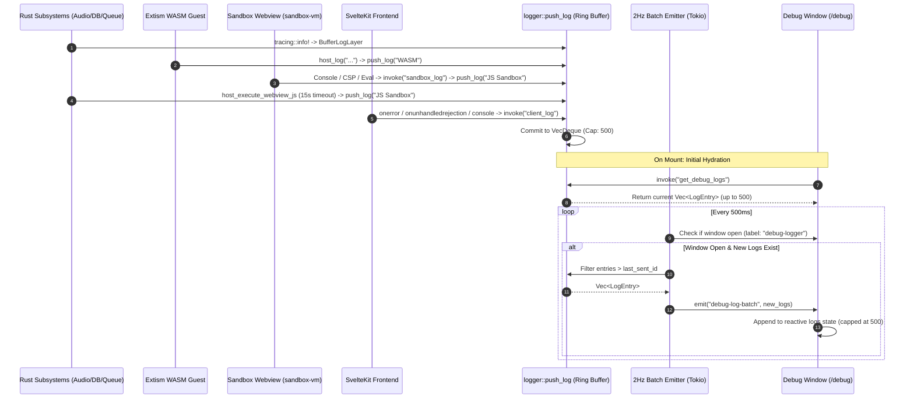

# Observability Architecture: Real-Time Diagnostic Pipeline

This document details the architecture, data structures, IPC contracts, and performance invariants of Lyria's 4-tier real-time observability and diagnostic pipeline (`/debug`).

---

## 1. The What

Lyria features an integrated, non-intrusive **4-Tier Diagnostic Pipeline** designed to monitor, capture, and display runtime telemetry across all layers of the application without degrading audio performance or flooding developer terminals.

```
┌────────────────────────────────────────────────────────────────────────────────────────┐
│                                 4-TIER TELEMETRY SOURCES                               │
├───────────────────┬───────────────────┬────────────────────────┬───────────────────────┤
│      TIER 1       │      TIER 2       │         TIER 3         │        TIER 4         │
│  RUST BACKEND     │   WASM PLUGINS    │    FRONTEND RUNTIME    │      JS SANDBOX       │
│     TRACING       │  (EXTISM GUESTS)  │   (CONSOLE / WINDOW)   │   (HIDDEN WEBVIEW)    │
├───────────────────┼───────────────────┼────────────────────────┼───────────────────────┤
│ • Audio Engine    │ • Plugin Host Log │ • Uncaught Exceptions  │ • JS Script Attest    │
│ • Database Actor  │ • Extism panics   │ • Promise Rejections   │ • 15s Timeout Aborts  │
│ • Queue Mutex     │ • HTTP capability │ • Console Warn / Error │ • CSP Violations      │
│ • Network Stream  │ • Memory bounds   │ • IPC invoke errors    │ • sandbox_log IPC     │
└───────────────────┴───────────────────┴────────────────────────┴───────────────────────┘
                                        │
                                        ▼
┌────────────────────────────────────────────────────────────────────────────────────────┐
│                        CENTRAL INGESTION & DISPATCH PIPELINE                           │
├────────────────────────────────────────────────────────────────────────────────────────┤
│ • Memory-Bounded Tracing Layer (`BufferLogLayer` via `tracing-subscriber`)             │
│ • Lock-Guarded Circular Ring Buffer (`VecDeque<LogEntry>`, Capacity: 500)             │
│ • Daily Rolling Disk Appender (`logs/echo.log.YYYY-MM-DD` via `tracing-appender`)      │
│ • Dynamic Collection Toggle (`LOG_COLLECTION_ENABLED: AtomicBool`)                    │
│ • Muted Terminal Stdout by Default (Opt-in via `RUST_LOG_STDOUT=1`)                    │
│ • Parallel Error Telemetry Store (`telemetry::record_error` / `ERROR_LOG`)             │
└───────────────────────────────────────┬────────────────────────────────────────────────┘
                                        │
                                        ▼
┌────────────────────────────────────────────────────────────────────────────────────────┐
│                         2 HZ BATCHED IPC STREAMING EMITTER                             │
├────────────────────────────────────────────────────────────────────────────────────────┤
│ • Background Tokio interval timer (500ms tick)                                         │
│ • Monotonic sequence tracking (`last_sent_id`) prevents duplicate payload transfers    │
│ • Zero-overhead when debug console is closed (short-circuits window lookup)            │
└───────────────────────────────────────┬────────────────────────────────────────────────┘
                                        │
                                        ▼
┌────────────────────────────────────────────────────────────────────────────────────────┐
│                  DEDICATED WEBVIEW DIAGNOSTIC CONSOLE (`/debug`)                       │
├────────────────────────────────────────────────────────────────────────────────────────┤
│ • Multi-category routing (Backend, Frontend, WASM, JS Sandbox, Audio, DB, Network)    │
│ • Live severity filtering (INFO, WARN, ERROR, DEBUG) & instant substring search        │
│ • Auto-scroll lock, stream pause/resume, full-buffer clipboard copy, and log directory │
└────────────────────────────────────────────────────────────────────────────────────────┘
```

---

## 2. The Why

### Eliminating Developer Blind Spots in Hybrid Desktop Stacks
Desktop applications built on Tauri bridge multiple isolated execution environments:
1. Native compiled Rust (OS threads and Tokio tasks).
2. Embedded WebAssembly bytecode (Extism plugin sandboxes).
3. JavaScript execution environments (isolated headless Webview window `sandbox-vm` for signature dynamic attestation).
4. Webview frontend processes (SvelteKit rendering engine).

In traditional architectures, a failure in a sandboxed WASM plugin or an unhandled rejection in the Webview fails silently or outputs to obscured browser developer tools unreachable by standard support workflows. Lyria unifies all four domains into a single cohesive diagnostic pipeline.

### Protecting Real-Time Audio Performance
Audio processing is strictly time-critical. The playback thread must push audio samples to hardware sinks every few milliseconds. If logging operations perform blocking synchronous I/O, allocate on the heap unbounded, or acquire contested locks, audio underruns (audible clicks, pops, and dropouts) occur.

### Terminal Hygiene & Privacy
High-frequency audio seeking, buffer filling, and database index queries generate hundreds of log lines per minute. Flooding terminal stdout degrades developer productivity, risks terminal buffer bottlenecks, and can leak user library filepaths into CI/terminal logs. Lyria mutes terminal stdout by default, directing all telemetry to circular memory and rolling files.

---

## 3. The Reasoning

### 3.1 Fixed-Capacity Circular Buffer (`VecDeque<LogEntry>`)
To prevent unbounded memory growth over long-running sessions, the in-memory telemetry buffer is capped at exactly $500$ entries:
* **Bounded Allocation**: At $\sim 200\text{ bytes}$ per entry, the entire active diagnostic log occupies less than $120\text{ KB}$ of RAM, easily adhering to Lyria's $40\text{ MB}$ memory budget.
* **FIFO Eviction**: When the buffer reaches 500 entries, the oldest entry is popped via `buffer.pop_front()` before pushing new entries.
* **Atomic Monotonic IDs**: Entries receive a monotonically increasing 64-bit identifier (`AtomicU64`). This enables consumers to query deltas without transferring duplicate log slices.

### 3.2 2 Hz Batched Event Emitter vs. Event Flooding
Streaming every individual log line over the Tauri IPC bridge (`app_handle.emit`) creates massive bridge contention. Under heavy provider operations, dozens of log events occur within milliseconds.
* **The Solution**: A background Tokio task runs on a 500ms interval ($2\text{ Hz}$).
* If the dedicated `debug-logger` window is not open, the task executes a no-op check and immediately sleeps.
* If open, it extracts only unread entries (`id > last_sent_id`) and transmits them in a single aggregated batch (`debug-log-batch`).

### 3.3 Memory-Bounded Tracing Visitor
Rust's `tracing` crate provides structured metadata without heavy formatting dependencies. Lyria implements a custom `BufferLogLayer` using a lightweight field visitor (`MessageVisitor`). The visitor extracts formatted string values and categorizes events based on the target module name before submitting to the ring buffer.

### 3.4 Terminal Stdout Policy (`RUST_LOG_STDOUT=1`)
Standard stdout logging is completely disabled in production and development by default.
* Stdout is only wired to `tracing_subscriber` if the environment variable `RUST_LOG_STDOUT=1` or `RUST_LOG_STDOUT=true` is set.
* Non-blocking daily rolling files on disk (`tracing-appender`) preserve persistent history without blocking Tokio worker threads.

### 3.5 Dynamic Collection Toggle
To eliminate even minimal tracing and lock overhead when diagnostic logging is unwanted, Lyria maintains an atomic switch (`LOG_COLLECTION_ENABLED: AtomicBool`):
* Checked upfront in `push_log` and `BufferLogLayer::on_event`.
* When toggled off (via `set_log_collection_enabled` or Settings UI), all log collection immediately short-circuits before acquiring the `LOG_BUFFER` lock.

---

## 4. The How

### 4.1 Telemetry Data Flow



---

### 4.2 Data Structures & Rust Implementation

The observability subsystem is located in `src-tauri/src/logger.rs`.

#### Core Log Entry:
```rust
#[derive(Debug, Clone, Serialize, Deserialize)]
pub struct LogEntry {
    pub id: u64,
    pub timestamp: i64,
    pub category: String,
    pub level: String,
    pub message: String,
}
```

#### Ring Buffer, Atomics & Mutex:
```rust
static LOG_ID_COUNTER: AtomicU64 = AtomicU64::new(1);
static LOG_COLLECTION_ENABLED: AtomicBool = AtomicBool::new(true);
const MAX_LOG_ENTRIES: usize = 500;

pub fn is_log_collection_enabled() -> bool {
    LOG_COLLECTION_ENABLED.load(Ordering::Relaxed)
}

pub fn set_log_collection_active(enabled: bool) {
    LOG_COLLECTION_ENABLED.store(enabled, Ordering::Relaxed);
}

lazy_static::lazy_static! {
    static ref LOG_BUFFER: Mutex<VecDeque<LogEntry>> = 
        Mutex::new(VecDeque::with_capacity(MAX_LOG_ENTRIES));
}
```

#### Buffer Insertion Routine:
```rust
pub fn push_log(category: &str, level: &str, message: &str) {
    if !is_log_collection_enabled() {
        return;
    }

    let entry = LogEntry {
        id: LOG_ID_COUNTER.fetch_add(1, Ordering::Relaxed),
        timestamp: std::time::SystemTime::now()
            .duration_since(std::time::UNIX_EPOCH)
            .map(|d| d.as_millis() as i64)
            .unwrap_or(0),
        category: category.to_string(),
        level: level.to_string(),
        message: message.to_string(),
    };

    if let Ok(mut buffer) = LOG_BUFFER.lock() {
        if buffer.len() >= MAX_LOG_ENTRIES {
            buffer.pop_front();
        }
        buffer.push_back(entry);
    }
}
```

#### Rolling Disk Appender:
Configured inside `init_logging` to write non-blocking logs to `$DATA_DIR/logs/echo.log.YYYY-MM-DD`:
```rust
if let Ok(app_dir) = crate::get_lyria_data_dir(app) {
    let log_dir = app_dir.join("logs");
    let _ = std::fs::create_dir_all(&log_dir);

    let file_appender = tracing_appender::rolling::daily(&log_dir, "echo.log");
    let (non_blocking, _guard) = tracing_appender::non_blocking(file_appender);

    let file_layer = tracing_subscriber::fmt::layer()
        .with_writer(non_blocking)
        .with_ansi(false);

    let _ = tracing_subscriber::registry()
        .with(env_filter)
        .with(stdout_layer)
        .with(file_layer)
        .with(buffer_layer)
        .try_init();
}
```

---

### 4.3 Tracing Layer & Category Mapping

The `BufferLogLayer` inspects `event.metadata().target()` to classify events into system categories:

```rust
let category = if target.starts_with("echo_desktop::audio") || target.contains("audio") {
    "Audio"
} else if target.starts_with("echo_desktop::db") || target.contains("db") || target.contains("rusqlite") {
    "Database"
} else if target.contains("wasm") || target.contains("plugin") || target.contains("extism") {
    "WASM"
} else if target.contains("reqwest") || target.contains("hyper") || target.contains("network") {
    "Network"
} else if target.starts_with("echo_desktop") {
    "Backend"
} else {
    "System"
};
```

---

### 4.4 2 Hz Batched IPC Emitter

Spawns inside `init_logging` to service open diagnostic windows:

```rust
tauri::async_runtime::spawn(async move {
    let mut interval = tokio::time::interval(std::time::Duration::from_millis(500));
    let mut last_sent_id: u64 = 0;

    loop {
        interval.tick().await;

        if let Some(debug_window) = app_handle.get_webview_window("debug-logger") {
            let new_logs: Vec<LogEntry> = if let Ok(buffer) = LOG_BUFFER.lock() {
                buffer.iter().filter(|e| e.id > last_sent_id).cloned().collect()
            } else {
                Vec::new()
            };

            if let Some(last) = new_logs.last() {
                last_sent_id = last.id;
            }

            if !new_logs.is_empty() {
                let _ = debug_window.emit("debug-log-batch", new_logs);
            }
        }
    }
});
```

---

### 4.5 WASM Host Logging Capability

Exposed to Extism guest plugins via the host function `host_log` (`src-tauri/src/providers/wasm_bridge.rs`):

```rust
host_fn!(pub host_log (input: String) -> () {
    crate::logger::push_log("WASM", "INFO", &input);
    tracing::info!(target: "echo_desktop::wasm", "[PLUGIN LOG] {}", input);
    Ok(())
});
```

---

### 4.6 JS Sandbox Execution & Telemetry Bridge

Dynamic signature attestation scripts execute within an isolated headless Webview window labeled `sandbox-vm` loading `static/sandbox.html` ([src-tauri/src/sandbox/sandbox_vm.rs](file:///home/ritwikg/Repository/echo-desktop/src-tauri/src/sandbox/sandbox_vm.rs)).

#### Sandbox Security & Logging (`static/sandbox.html`):
* **Strict CSP**: Prevents arbitrary network access:
  ```html
  <meta http-equiv="Content-Security-Policy" content="default-src 'none'; script-src 'unsafe-eval' 'unsafe-inline' blob:; worker-src blob:; connect-src ipc: http://ipc.localhost;">
  ```
* **Console & CSP Violation Interception**: `console.log`, `console.warn`, `console.error`, `window.onerror`, and `securitypolicyviolation` events are intercepted and forwarded back to Rust using the `sandbox_log` IPC command:
  ```javascript
  window.__TAURI__.core.invoke('sandbox_log', {
      category: 'JS Sandbox',
      level: level.toUpperCase(),
      message: message
  });
  ```

#### Host Invocation & 15s Timeout Enforcement (`src-tauri/src/providers/wasm_bridge.rs`):
When WASM invokes `host_execute_webview_js`, execution is bounded by a Tokio 15-second timeout:
```rust
host_fn!(pub host_execute_webview_js (user_data: Arc<tauri::AppHandle>; script: String) -> String {
    let app = user_data.get()?.lock().unwrap().clone();
    let state = app.state::<crate::AppState>();
    
    let rt = tokio::runtime::Handle::current();
    let res = rt.block_on(async {
        match tokio::time::timeout(
            std::time::Duration::from_secs(15), 
            crate::sandbox::sandbox_vm::execute_javascript(&app, &state.sandbox_manager, &script)
        ).await {
            Ok(Ok(result)) => {
                crate::logger::push_log("JS Sandbox", "DEBUG", "JS execution completed successfully");
                Ok(result.to_string())
            },
            Ok(Err(err)) => {
                crate::logger::push_log("JS Sandbox", "ERROR", &format!("JS execution error: {}", err));
                Err(extism::Error::msg(err))
            },
            Err(_) => {
                crate::logger::push_log("JS Sandbox", "ERROR", "JS execution timeout after 15s");
                Err(extism::Error::msg("JS execution timeout"))
            },
        }
    })?;
    
    Ok(res)
});
```

---

### 4.7 Frontend Runtime Interceptor (`src/app.html`)

An early script injected into `src/app.html` catches runtime failures, uncaught promise rejections, and browser console warnings/errors before Svelte boots:

```javascript
(function() {
  var isForwarding = false;
  function forwardToRust(level, msg) {
    if (isForwarding) return;
    try {
      if (window.__TAURI__ && window.__TAURI__.core && typeof window.__TAURI__.core.invoke === 'function') {
        isForwarding = true;
        window.__TAURI__.core.invoke('client_log', {
          category: 'Frontend',
          level: level,
          message: String(msg)
        }).catch(function() {}).finally(function() { isForwarding = false; });
      }
    } catch (_) {
      isForwarding = false;
    }
  }

  window.addEventListener('error', function(e) {
    if (e.message && e.message.includes('ResizeObserver loop')) {
      e.preventDefault();
      return;
    }
    var loc = e.filename ? ' at ' + e.filename + ':' + e.lineno : '';
    forwardToRust('ERROR', (e.message || 'Unknown Error') + loc);
  });

  window.addEventListener('unhandledrejection', function(e) {
    var reason = e.reason && e.reason.message ? e.reason.message : String(e.reason);
    forwardToRust('ERROR', 'Unhandled Rejection: ' + reason);
  });

  var origWarn = console.warn;
  console.warn = function() {
    origWarn.apply(console, arguments);
    var msg = Array.from(arguments).map(function(a) {
      return typeof a === 'object' ? JSON.stringify(a) : String(a);
    }).join(' ');
    forwardToRust('WARN', msg);
  };

  var origError = console.error;
  console.error = function() {
    origError.apply(console, arguments);
    var msg = Array.from(arguments).map(function(a) {
      return typeof a === 'object' ? JSON.stringify(a) : String(a);
    }).join(' ');
    forwardToRust('ERROR', msg);
  };
})();
```

---

### 4.8 Dedicated Diagnostic UI (`src/routes/debug/+page.svelte`)

The debug console renders a standalone, hardware-inspired terminal view:
* **Initial Hydration**: On mount, queries `await invoke<LogEntry[]>("get_debug_logs")` to fetch historical logs currently in memory.
* **Batch Ingestion**: Listens for `debug-log-batch` events and appends them to local reactive state: `logs = [...logs, ...e.payload].slice(-500)`.
* **Category Filtering**: Segmented buttons for `All`, `Backend`, `Frontend`, `WASM`, `JS Sandbox`, `Audio`, `Database`, `Network`, and `System`.
* **Level Toggles**: Checkbox pills for `INFO`, `WARN`, `ERROR`, `DEBUG`.
* **Search Substring Match**: Real-time case-insensitive substring search matching against log message bodies and category names.
* **Auto-Scroll Locking**: Automatically scrolls the log container to the bottom on new batches unless disabled or when navigating history.
* **Action Bar**:
  * `Pause / Resume`: Freezes visual updates (`isPaused = true`) without dropping incoming backend logs.
  * `Copy Logs`: Calls the `copy_debug_log_to_clipboard` IPC command to export the full backend buffer formatted as `[timestamp] [level] [category] message`.
  * `Clear Buffer`: Calls `clear_debug_logs` IPC command to wipe the ring buffer.
  * `Log Folder`: Calls `open_log_directory` to launch OS native file explorer (`xdg-open`, `explorer`, or `open`) pointing to `$DATA_DIR/logs/`.

---

### 4.9 Secondary Error Telemetry Pipeline (`telemetry.rs`)

Complementing the ring buffer logger, `src-tauri/src/telemetry.rs` provides a specialized error tracking system used across queue recovery and command error flows:
* **Error Log Vector**: `Mutex<Vec<ErrorEvent>>` retaining the latest 1,000 error events.
* **Monotonic Counter**: `ERROR_COUNT: AtomicU64` tracking cumulative lifetime backend errors.
* **Dual Reporting**: Calling `telemetry::record_error(category, message)` records the structured event in `ERROR_LOG` and simultaneously emits `tracing::error!("[{}] {}", category, message)`, which automatically routes back into `BufferLogLayer` and `/debug`.

---

## 5. Architectural Invariants

1. **Non-Blocking Ingestion**: Pushing a log entry must never block on disk I/O, network requests, or Tokio asynchronous tasks.
2. **Strict Memory Bounds**: The in-memory buffer must never exceed 500 entries under any circumstance.
3. **Muted Terminal by Default**: Terminal stdout must remain silent unless explicitly activated with `RUST_LOG_STDOUT=1` or `RUST_LOG_STDOUT=true`.
4. **Throttled IPC Emission**: The Tauri IPC bridge must never be invoked per-log-event; emissions are strictly throttled to 2 Hz.
5. **Fail-Safe UI Interception**: Frontend telemetry interceptors must never throw exceptions or trigger infinite recursive error loops.
6. **Isolated Sandbox Execution**: JS execution must remain strictly bounded by CSP (`connect-src ipc:`) and a 15-second host timeout.
