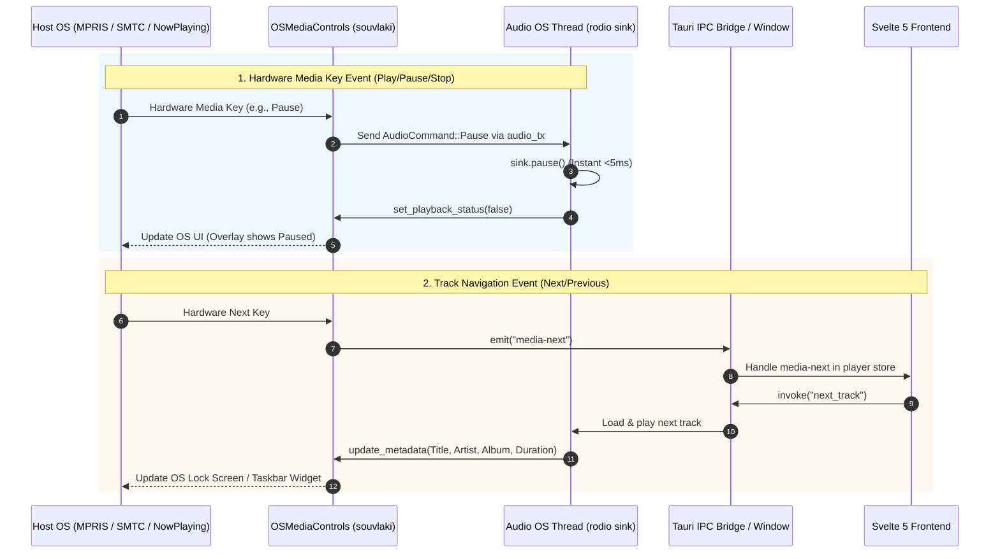

# OS Integration Architecture: Native Desktop Citizenship

This document specifies the architecture, cross-platform abstractions, system-level integrations, and packaging configurations that govern Lyria's operation as a native desktop citizen across Linux, macOS, and Windows.

---

## 1. The What

The OS Integration Subsystem bridges Lyria's core audio engine and database actors to host operating system facilities. Rather than operating as an isolated browser application in an Electron/Webview wrapper, Lyria integrates deeply with OS desktop standards:

```
┌────────────────────────────────────────────────────────────────────────────────────────┐
│                                 OS INTEGRATION SURFACE                                 │
├───────────────────┬───────────────────┬────────────────────────┬───────────────────────┤
│  MEDIA CONTROLS   │ WINDOW LIFECYCLE  │   PLATFORM SECRETS     │   FILESYSTEM & ASSETS │
│    (SOUVLAKI)     │   (TAURI 2.0)     │      (KEYRING)         │    (TAURI PLUGINS)    │
├───────────────────┼───────────────────┼────────────────────────┼───────────────────────┤
│ • Linux: MPRIS    │ • 1200x800 Initial│ • macOS: Keychain      │ • Scoped asset: proto │
│ • Windows: SMTC   │ • 640x480 Min     │ • Windows: Credential  │ • Native folder picker│
│ • macOS: NowPlay  │ • Graceful exit   │ • Linux: SecretService │ • OS file revealers   │
│ • Hardware keys   │ • Clean audio drop│ • SQLite fallback      │ • Strict CSP sandbox  │
└───────────────────┴───────────────────┴────────────────────────┴───────────────────────┘
```

### Core Subsystem Responsibilities:
1. **Universal Hardware Media Controls (`souvlaki`)**:
   * Registers Lyria with OS media session buses: Linux D-Bus MPRIS (`org.mpris.MediaPlayer2.lyria`), Windows System Media Transport Controls (SMTC), and macOS NowPlaying Center.
   * Intercepts hardware keys (Play/Pause, Next, Previous, Stop) from keyboards, Bluetooth headsets, and lock screens.
   * Streams track metadata (Title, Artist, Album, Duration) and playback state (`Playing`, `Paused`) to OS volume overlays.
2. **Platform Secret Storage (`ProviderSecretStore`)**:
   * Prioritizes hardware-backed OS credential vaults (`keyring` crate) for streaming provider API tokens and sensitive session secrets.
   * Provides a transparent fallback to encrypted SQLite tables when running in headless or daemonless desktop environments.
3. **Window Lifecycle & Application Boundary**:
   * Manages desktop window geometry, display constraints, and hardware-accelerated rendering.
   * Intercepts native close requests to guarantee clean audio sink shutdown, database connection pooling flush, and thread pool joins.
4. **Asset Protocol & Filesystem Scoping**:
   * Enforces a secure custom URI scheme (`asset:`) restricted strictly to cached album artwork in `$APPDATA/artwork/**`.
   * Invokes native OS file dialogs via `tauri-plugin-dialog` and launches system file explorers (`xdg-open`, `explorer`, `open`).

---

## 2. The Why

### Native Desktop Citizenship vs. Web App Isolation
A desktop music player that fails to respond to keyboard media keys or vanishes from OS lock screens feels disconnected and cheap. Modern operating systems expect audio applications to expose declarative state:
* **Linux**: Window managers and desktop shells (GNOME, KDE Plasma, Wayland compositors) query D-Bus MPRIS to display player widgets in system trays and top bars.
* **Windows**: The OS requires binding to an active `HWND` window handle to display interactive thumbnail toolbars in the Windows Taskbar and the global volume overlay.
* **macOS**: The Control Center and Touch Bar depend on the Cocoa `MPNowPlayingInfoCenter` to show track progress and cover artwork.

### Hard Real-Time Concurrency for Media Keys
When a user presses the hardware Pause key or removes their Bluetooth headphones, the music must stop **instantly** ($<5\text{ms}$). Routing media events through the Webview JavaScript event loop introduces latency and risks stalling if the DOM thread is busy rendering an image grid. Lyria couples OS media key events directly to the dedicated audio OS thread via lock-free `mpsc` channels.

### Secure Secret Management Without Daemon Assumptions
WASM extensions and remote providers frequently require API keys and user tokens. Storing these credentials in plaintext configuration files introduces security vulnerabilities. However, assuming that every Linux system runs a functional Secret Service daemon (e.g., GNOME Keyring or KWallet) leads to startup crashes on tiling window managers (i3, sway, dwm). Lyria resolves this with an OS-first, SQLite-fallback tiered storage model.

---

## 3. The Reasoning

### 3.1 The `souvlaki` Abstraction Layer
Instead of maintaining three distinct, brittle C-FFI bindings for D-Bus, Win32 COM, and Objective-C Cocoa, Lyria utilizes `souvlaki` (version 0.7.3):
* **Single Unified Trait**: Provides a clean Rust abstraction over `MediaControls`, `MediaMetadata`, and `PlatformConfig`.
* **Zero Overhead**: Directly invokes the platform's native C/Obj-C APIs without spawning external wrapper helper processes.
* **Direct Audio Thread Coupling**: The media control callback routes playback mutations (`Play`, `Pause`, `Stop`) straight into `state.audio_tx`, bypassing Tokio and the Webview. Navigational events (`Toggle`, `Next`, `Previous`) are dispatched to the Tauri event bus.

### 3.2 Dynamic Windows `HWND` Extraction
On Windows, SMTC integration fails unless the application binds to a valid Win32 window handle (`HWND`). 
* In Tauri 2.0, the window handle is extracted dynamically during `setup`:
  ```rust
  let hwnd = {
      if let Some(window) = app_handle.get_webview_window("main") {
          window.hwnd().ok().map(|h| h.0 as *mut std::ffi::c_void)
      } else {
          None
      }
  };
  ```
* This ensures full Windows 10/11 taskbar media thumbnail support without requiring manual Win32 window creation.

### 3.3 Two-Tier Secret Fallback Architecture
The `ProviderSecretStore` resolves secrets using a deterministic hierarchy:
1. **Tier 1 (OS Native Vault)**: Service identifier `com.ritwik.lyria`, account key `<provider_id>:<key>`. On macOS, this uses the Apple Keychain; on Windows, Windows Credential Manager; on Linux, D-Bus Secret Service.
2. **Tier 2 (SQLite Fallback)**: If the keyring returns `NoEntry`, or if the platform daemon is unavailable, the secret is funneled through the database actor channel (`db_tx`) into the `settings` table with key `provider:<provider_id>:<key>`.

### 3.4 Scoped Asset Protocol & Content Security Policy (CSP)
To comply with strict security standards, Lyria isolates the Webview from arbitrary filesystem access:
* The Tauri asset protocol is scoped exclusively to:
  ```json
  "assetProtocol": {
    "enable": true,
    "scope": ["$APPDATA/artwork/**"]
  }
  ```
* Audio files (`.flac`, `.mp3`, `.wav`) are **never** loaded into the browser context via `asset:`. The frontend only deals with metadata primitives and track IDs; audio decoding occurs exclusively in native Rust via Symphonia.

---

## 4. The How

### 4.1 Integration Topology



---

### 4.2 Rust Implementation: `OSMediaControls`

Located in `src-tauri/src/audio/media_controls.rs`:

```rust
pub struct OSMediaControls {
    controls: Mutex<Option<MediaControls>>,
}

impl OSMediaControls {
    pub fn new(app_handle: &AppHandle) -> Self {
        #[cfg(target_os = "windows")]
        let hwnd = {
            if let Some(window) = app_handle.get_webview_window("main") {
                window.hwnd().ok().map(|h| h.0 as *mut std::ffi::c_void)
            } else {
                None
            }
        };

        #[cfg(not(target_os = "windows"))]
        let hwnd = None;

        let config = PlatformConfig {
            dbus_name: "lyria",
            display_name: "Lyria",
            hwnd,
        };

        let mut controls = MediaControls::new(config);
        
        if let Ok(ref mut controls) = controls {
            let app_handle_clone = app_handle.clone();
            controls.attach(move |event| {
                use souvlaki::MediaControlEvent::*;
                match event {
                    Play => {
                        let tx = {
                            let state = app_handle_clone.state::<crate::AppState>();
                            state.audio_tx.lock().ok().cloned()
                        };
                        if let Some(tx) = tx {
                            let _ = tx.send(crate::audio::AudioCommand::Play);
                        }
                    }
                    Pause => {
                        let tx = {
                            let state = app_handle_clone.state::<crate::AppState>();
                            state.audio_tx.lock().ok().cloned()
                        };
                        if let Some(tx) = tx {
                            let _ = tx.send(crate::audio::AudioCommand::Pause);
                        }
                    }
                    Toggle => {
                        let _ = app_handle_clone.emit("media-play-pause", ());
                    }
                    Next => {
                        let _ = app_handle_clone.emit("media-next", ());
                    }
                    Previous => {
                        let _ = app_handle_clone.emit("media-prev", ());
                    }
                    Stop => {
                        let tx = {
                            let state = app_handle_clone.state::<crate::AppState>();
                            state.audio_tx.lock().ok().cloned()
                        };
                        if let Some(tx) = tx {
                            let _ = tx.send(crate::audio::AudioCommand::Stop);
                        }
                    }
                    _ => {}
                }
            }).ok();
        }

        Self {
            controls: Mutex::new(controls.ok()),
        }
    }

    pub fn update_metadata(&self, title: &str, artist: &str, album: &str, duration: Option<std::time::Duration>) {
        if let Ok(mut lock) = self.controls.lock() {
            if let Some(controls) = lock.as_mut() {
                let mut metadata = MediaMetadata {
                    title: Some(title),
                    artist: Some(artist),
                    album: Some(album),
                    ..Default::default()
                };
                if let Some(d) = duration {
                    metadata.duration = Some(d);
                }
                let _ = controls.set_metadata(metadata);
            }
        }
    }

    pub fn set_playback_status(&self, playing: bool) {
        if let Ok(mut lock) = self.controls.lock() {
            if let Some(controls) = lock.as_mut() {
                let status = if playing {
                    MediaPlayback::Playing { progress: None }
                } else {
                    MediaPlayback::Paused { progress: None }
                };
                let _ = controls.set_playback(status);
            }
        }
    }
}
```

---

### 4.3 Rust Implementation: `ProviderSecretStore`

Located in `src-tauri/src/providers/secrets.rs`:

```rust
pub struct ProviderSecretStore {
    service_name: String,
}

impl ProviderSecretStore {
    pub fn new() -> Self {
        Self {
            service_name: "com.ritwik.lyria".to_string(),
        }
    }

    pub fn get(&self, provider_id: &str, key: &str, db_tx: &mpsc::Sender<DbRequest>) -> Option<String> {
        let account = format!("{}:{}", provider_id, key);

        // 1. Attempt OS Keyring
        if let Ok(entry) = keyring::Entry::new(&self.service_name, &account) {
            if let Ok(val) = entry.get_password() {
                return Some(val);
            }
        }

        // 2. Fallback to SQLite settings table via DB actor channel
        let sqlite_key = format!("provider:{}:{}", provider_id, key);
        let (tx, rx) = oneshot::channel();
        if db_tx.send(DbRequest::GetSetting { key: sqlite_key, resp: tx }).is_ok() {
            if let Ok(Ok(val)) = rx.blocking_recv() {
                return val;
            }
        }
        None
    }
}
```

---

### 4.4 Window Lifecycle & Graceful Shutdown

In `src-tauri/src/lib.rs`, the application monitors native window events:

```rust
.on_window_event(|window, event| {
    if let tauri::WindowEvent::CloseRequested { .. } = event {
        if window.label() == "main" {
            println!("Lyria shutting down...");
            tracing::info!("Main window close requested, initiating shutdown");
            window.app_handle().exit(0);
        }
    }
})
```

When `exit(0)` is invoked:
1. Tokio runtime aborts active network downloads gracefully.
2. The dedicated database actor thread receives channel disconnect and flushes SQLite WAL checkpoints.
3. The dedicated audio OS thread terminates its `rodio` sink, halting sound output cleanly without DAC buffer clicks.

---

### 4.5 Configuration & Cross-Platform Packaging

Configured in `src-tauri/tauri.conf.json` and `src-tauri/Cargo.toml`:

#### Binary Specification (`Cargo.toml`):
```toml
[[bin]]
name = "lyria"
path = "src/main.rs"
```

#### Window Dimensions & Security Scope (`tauri.conf.json`):
```json
{
  "productName": "Lyria",
  "version": "0.2.3",
  "identifier": "com.ritwik.lyria",
  "app": {
    "windows": [
      {
        "title": "Lyria",
        "width": 1200,
        "height": 800,
        "minWidth": 640,
        "minHeight": 480,
        "label": "main"
      }
    ],
    "security": {
      "csp": "default-src 'self'; font-src 'self' data:; script-src 'self' 'unsafe-inline' 'unsafe-eval'; img-src 'self' asset: https://asset.localhost https://*.ytimg.com https://*.googleusercontent.com https: data: blob:; style-src 'self' 'unsafe-inline'; media-src 'self' https: http: asset: blob:;",
      "assetProtocol": {
        "enable": true,
        "scope": ["$APPDATA/artwork/**"]
      }
    }
  },
  "bundle": {
    "active": true,
    "targets": "all",
    "icon": [
      "icons/32x32.png",
      "icons/128x128.png",
      "icons/128x128@2x.png",
      "icons/icon.icns",
      "icons/icon.ico"
    ]
  }
}
```

---

## 5. Architectural Invariants

1. **Lock-Free Media Key Response**: Hardware media key events (`Play`, `Pause`, `Stop`) must route directly to the audio OS thread via non-blocking channels; they must never await Tokio task futures or Webview IPC roundtrips.
2. **Crash-Resilient Secret Storage**: Failure to access the host OS keyring must never panic or crash the application; it must silently fall back to the SQLite settings actor.
3. **Strict Asset Containment**: The Webview asset protocol must remain restricted exclusively to `$APPDATA/artwork/**`. Audio media files must never be served through the web asset layer.
4. **Clean OS Window Teardown**: Closing the primary application window must initiate an orderly process shutdown, closing background threads and flushing database transactions cleanly.
