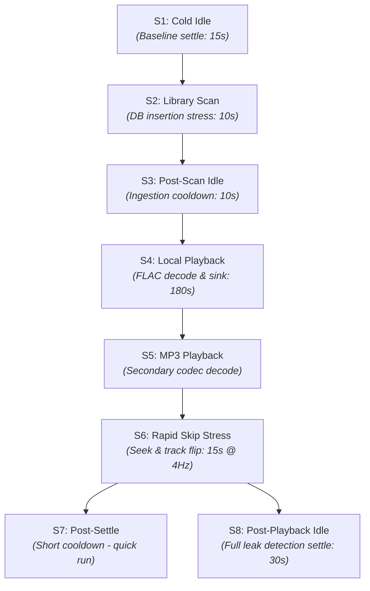

# Benchmarking Specification & Runbook

This document details the architectural principles, environmental protocols, scenario lifecycles, and failure thresholds governing Lyria's automated performance and memory benchmarking suite (`scripts/benchmark_memory.py`).

---

## 1. The What

The Lyria Benchmarking Suite is an automated, non-invasive telemetry pipeline designed to measure, validate, and enforce resource bounds on developer laptops and continuous integration environments. 

Rather than relying on synthetic microbenchmarks or uncalibrated resident-set approximations, the suite treats the running application as a multi-process hardware device, sampling `/proc` state at up to $4\text{ Hz}$ across the entire process tree.

```
┌────────────────────────────────────────────────────────────────────────────────────────┐
│                               BENCHMARK HARNESS TOPOLOGY                               │
├────────────────────────────────────────────────────────────────────────────────────────┤
│ • Runner: `scripts/benchmark-memory.sh` -> `scripts/benchmark_memory.py`               │
│ • Configuration Gates: `benchmarks/thresholds.json`                                   │
│ • Process Hierarchy: Host (`lyria`) + WebKit WebProcess + WebKit NetworkProcess        │
│ • Telemetry Scope: Anonymous RAM, PSS, VmHWM, File Descriptors, Audio Thread CPU %    │
│ • Report Artifacts: Markdown summaries & raw time-series JSON in `reports/`            │
└────────────────────────────────────────────────────────────────────────────────────────┘
```

### Core Metrics Captured:
* **Host Anonymous Memory (`rss_anon_kb`)**: Private, unswappable heap and stack memory allocated by the Rust runtime.
* **Proportional Set Size (`pss_kb`)**: Accurate shared-memory attribution for WebKit and system libraries via `/proc/[pid]/smaps_rollup`.
* **High-Water Mark (`vm_hwm_kb`)**: Peak physical memory mapped across process lifecycles.
* **Audio Thread CPU Utilization (`cpu_pct`)**: Dedicated kernel tick accounting for Rodio/Symphonia playback threads.
* **File Descriptor Capacity (`fd_count`)**: Open socket, pipe, and file handle tracking in `/proc/[pid]/fd`.
* **Temporary Disk Footprint (`temp_file_bytes`)**: Ephemeral cache accretion under `/tmp` and `$XDG_CACHE_HOME`.

---

## 2. The Why

### Eliminating the "Works on My Machine" Memory Fallacy
Desktop webview frameworks (Tauri, Electron) are frequently accused of memory bloat. However, raw `RSS` (Resident Set Size) figures reported by system task managers are notoriously misleading:
1. **Shared Library Inflation**: Operating system font caches, GL drivers, and shared C libraries (`libc`, `libgtk`) are counted redundantly against every process.
2. **Page Cache Artifacts**: File-backed read pages remain resident in memory until memory pressure forces eviction, creating the illusion of a leak.
3. **Lazy Allocator Retention**: The Rust allocator (`jemalloc` or system `glibc`) may retain freed heap chunks for reuse rather than immediately returning them to the OS kernel.

Lyria solves this by establishing **strict memory boundaries** anchored in **Anonymous Memory (`RssAnon`)** and **Proportional Set Size (`PSS`)**, paired with settling intervals that allow allocator pools to quiesce.

### Protecting the 40MB RAM Budget
Lyria's core architectural contract requires the background audio player to consume no more than $40\text{ MB}$ of active host RAM during sustained high-fidelity playback. Without automated regression gates, small leaks (e.g., in-flight HTTP ring buffers, unbounded Extism guest allocations, or SQLite statement caches) quietly breach this budget over time.

---

## 3. The Reasoning

### 3.1 The Environmental Advisory Protocol
Benchmark results are invalid if the host CPU is throttling, competing audio processes are active, or the operating system is thrashing swap space. Before sampling, the harness executes an **Advisory Environment Audit**:

```
┌────────────────────────────────────────────────────────────────────────────────────────┐
│                             ENVIRONMENTAL AUDIT PROTOCOL                               │
├───────────────────┬───────────────────────────────────┬────────────────────────────────┤
│ CHECK             │ VERIFICATION TARGET               │ FAILURE IMPACT                 │
├───────────────────┼───────────────────────────────────┼────────────────────────────────┤
│ CPU Governor      │ `/sys/devices/system/cpu/cpu*/...`│ Throttling skews CPU % metrics │
│ Swap Pressure     │ `/proc/meminfo` (SwapUsed == 0)   │ Anonymous pages pushed to disk │
│ Audio Conflicts   │ Competing daemons (Spotify, VLC)  │ Audio sink buffer contention   │
│ Page Cache State  │ Dirty/active file cache presence  │ Distorts scan read latency     │
│ Binary Packaging  │ Release profile vs. Debug symbols │ Debug symbols double heap size │
└───────────────────┴───────────────────────────────────┴────────────────────────────────┘
```

The harness computes a composite confidence rating:
* **`CONTROLLED`**: All environment checks pass. Assertions are strictly enforced.
* **`DEGRADED`**: Non-fatal anomalies detected (e.g., running on battery or with background browser tabs). Threshold assertions run with clear warnings.

### 3.2 Multi-Process Tree Discovery & Role Classification
A Tauri application is not a single process. On Linux, WebKit spawns multiple sandboxed helpers. The harness scans `/proc` to construct the full process hierarchy, classifying processes into four distinct telemetry roles:
1. **`host`**: The primary native Rust executable (`lyria` or `echo-desktop`).
2. **`webkit_web`**: The WebKit UI rendering engine (`WebKitWebProcess`).
3. **`webkit_net`**: The WebKit network and resource loader (`WebKitNetworkProcess`).
4. **`other`**: Auxiliary helpers or sandbox wrappers.

Threshold assertions target specific roles (e.g., `host_idle_anon_mb` inspects only the native daemon, while `total_idle_pss_mb` evaluates the entire tree).

### 3.3 The Settle-Cooldown Leak Detection Model
Memory leaks cannot be identified by measuring a single point in time. The harness evaluates leaks through a **before-and-after comparison**:
$$\text{Memory Leak} = \text{Anonymous RAM}_{\text{S8 (Post-Playback)}} - \text{Anonymous RAM}_{\text{S1 (Cold Idle)}}$$

If memory does not return to within `settle_leak_anon_mb` ($5.0\text{ MB}$) of the baseline after playback stops and a 30-second cooldown expires, the harness fails the build.

---

## 4. The How

### 4.1 The 8-Stage Scenario Lifecycle (S1–S8)



#### Detailed Stage Specifications:
1. **`S1_cold_idle`**: Evaluates quiescent application startup. Waits for initial window mount, Extism extension discovery, and database connection warmup to settle.
2. **`S2_library_scan`**: Simulates recursive directory walking and SQLite batch inserts. Tests single-writer actor throughput and bounded buffer allocation.
3. **`S3_post_scan_idle`**: Measures cache eviction. Ensures memory consumed during indexing is released after scanning terminates.
4. **`S4_local_playback`**: Sustained playback of uncompressed/lossless audio (FLAC/WAV). Measures steady-state heap growth and audio thread CPU percentage.
5. **`S5_mp3_playback`**: Sustained playback of lossy audio (MP3/AAC) to verify Symphonia decoder memory footprint across formats.
6. **`S6_rapid_skip`**: High-frequency track advancement (1 track every 1.5 seconds) sampled at $4\text{ Hz}$. Stress-tests ring buffer deallocation, seek generation counters, and stream abort cleanup.
7. **`S7_post_settle`**: Brief 10-second settling phase utilized during fast developer verification runs (`--quick`).
8. **`S8_post_playback_idle`**: Full 30-second cooldown phase. Halts audio playback, triggers garbage collection, and asserts that host memory returns to baseline.

---

### 4.2 Automated Threshold Assertions

Configured in `benchmarks/thresholds.json`:

```json
{
  "host_idle_anon_mb": 25.0,
  "total_idle_pss_mb": 120.0,
  "scan_peak_anon_mb": 45.0,
  "playback_audio_thread_cpu_pct": 5.0,
  "playback_anon_growth_mb": 8.0,
  "settle_leak_anon_mb": 5.0,
  "max_fd_count": 128,
  "max_temp_file_mb": 0.0
}
```

| Assertion Key | Evaluated Scenario | Limit | Architectural Rationale |
| :--- | :--- | :--- | :--- |
| **`host_idle_anon_mb`** | `S1_cold_idle` | $\le 25.0\text{ MB}$ | Rust host runtime, Tokio workers, and DB connections must stay compact. |
| **`total_idle_pss_mb`** | `S1_cold_idle` | $\le 120.0\text{ MB}$ | Total memory across Rust daemon and WebKit processes must not exceed standard desktop bounds. |
| **`scan_peak_anon_mb`** | `S2_library_scan` | $\le 45.0\text{ MB}$ | Batch inserts must stream via `DbRequest::InsertTracks` without buffering entire libraries. |
| **`playback_audio_thread_cpu_pct`** | `S4_local_playback` | $\le 5.0\%$ | Dedicated audio thread must decode and output with minimal CPU footprint. |
| **`playback_anon_growth_mb`** | `S4_local_playback` | $\le 8.0\text{ MB}$ | Ring buffers and network chunks must deallocate continuously during playback. |
| **`settle_leak_anon_mb`** | `S8_post_playback_idle` | $\le 5.0\text{ MB}$ | Quiescent state after playback must return to baseline (zero heap leaks). |
| **`max_fd_count`** | All Scenarios | $\le 128$ | Prevents socket leaks from WASM HTTP calls or unclosed audio file handles. |
| **`max_temp_file_mb`** | All Scenarios | $\le 0.0\text{ MB}$ | Zero temporary file leakage on disk; streams must be in-memory or properly cleaned. |

---

### 4.3 Developer Execution Runbook

The benchmarking harness provides multiple operational modes depending on development context:

#### 1. Quick Verification (Pre-Commit Gate)
Runs abbreviated settle intervals (5s cold, 10s playback, 10s post-settle) to validate threshold compliance in $<45\text{ seconds}$:
```bash
./scripts/benchmark-memory.sh --quick
```

#### 2. Full Regression Certification
Executes full 180s playback, stress testing, and 30s leak settling:
```bash
./scripts/benchmark-memory.sh
```

#### 3. Live Watch Dashboard (Tactile Hardware Monitor)
Attaches to an already running `lyria` process and renders a real-time ASCII hardware dashboard updating at $2\text{ Hz}$:
```bash
./scripts/benchmark-memory.sh --watch
# Or target a specific process ID:
./scripts/benchmark-memory.sh --watch --pid 12345
```

#### 4. Extended Soak Test (Burn-In Analysis)
Monitors an active instance for multiple hours (default 3,600s) to detect slow-creeping memory leaks:
```bash
./scripts/benchmark-memory.sh --soak --soak-duration 7200
```

---

### 4.4 Interpreting Benchmark Reports

When a benchmark run completes, artifacts are generated in `reports/`:
* **Markdown Summary (`reports/benchmark_YYYYMMDD_HHMMSS.md`)**: Formatted overview containing environment audit results, scenario metrics table, and pass/fail assertion checks.
* **Raw JSON Time-Series (`reports/benchmark_YYYYMMDD_HHMMSS.json`)**: High-resolution array of every individual `Sample` collected at $2\text{ Hz}$ or $4\text{ Hz}$, ready for ingestion into graphing tools or CI dashboards.

#### Sample Markdown Assertion Output:
```markdown
## Assertion Results
- [PASS] host_idle_anon_mb <= 25.0 MB (Actual: 18.42 MB)
- [PASS] total_idle_pss_mb <= 120.0 MB (Actual: 94.15 MB)
- [PASS] scan_peak_anon_mb <= 45.0 MB (Actual: 32.10 MB)
- [PASS] playback_audio_thread_cpu_pct <= 5.0% (Actual: 1.84%)
- [PASS] playback_anon_growth_mb <= 8.0 MB (Actual: 2.15 MB)
- [PASS] settle_leak_anon_mb <= 5.0 MB (Actual: 0.42 MB)
- [PASS] max_fd_count <= 128 (Actual: 42)
- [PASS] max_temp_file_mb <= 0.0 MB (Actual: 0.00 MB)

**OVERALL STATUS: PASSED**
```

---

## 5. Architectural Invariants

1. **Non-Invasive Sampling**: The benchmark suite must never mutate application state, inject debug hooks, or alter memory allocations while sampling.
2. **Deterministic Thresholds**: All threshold values in `benchmarks/thresholds.json` are binding release gates. A PR that fails memory thresholds must not be merged.
3. **Hardware Truth Over Heuristics**: Memory measurements must always be sourced directly from kernel `/proc/[pid]/statm` and `/proc/[pid]/smaps_rollup`. Synthetic profiling estimates are forbidden.
