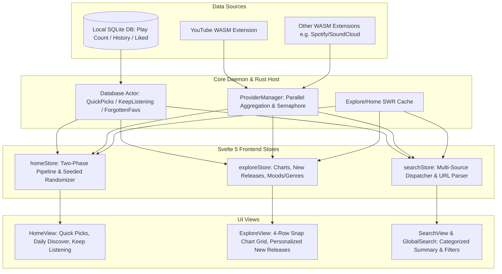

# Option 2 Master Implementation Plan: Multi-Extension Home & Explore Revamp

**System Intent:** Adapt and extend Metrolist's algorithmic recommendation engine, explore charts, and search architecture into Echo's lightweight, multi-extension SvelteKit + Tauri 2.0 system.

---

## Architecture Overview & Multi-Extension Design



---

## 5-Phase Roadmap

```
Option 2: Multi-Extension Home & Explore Revamp
 ├── Phase 1: Multi-Extension Explore & Module Aggregation Engine (Backend & WASM)
 ├── Phase 2: Algorithmic Local Personalization & Hybrid Store (SQLite & Rust DB Actor)
 ├── Phase 3: Modern Home Page Dashboard UI (Svelte 5 Runes & Responsive Grids)
 ├── Phase 4: Explore Page Revamp (Charts, Snap Grids & Personalized Releases)
 └── Phase 5: Unified Multi-Source Search & Live URL Interceptor
```

---

### Phase 1: Multi-Extension Explore & Module Aggregation Engine
* **Goal:** Enable extensions to export rich Explore feeds (Charts, New Releases, Moods/Genres) and aggregate them asynchronously in Rust with stale-while-revalidate caching and error isolation.
* **Key Tasks:**
  1. **YouTube WASM Explore Parser:** Ingest `FEmusic_explore` and `FEmusic_charts` inside `youtube-wasm`, returning structured modules (`Trending Songs`, `Top Music Videos`, `New Release Albums`, `Moods & Genres`).
  2. **Multi-Extension Module Aggregation:** `ProviderManager::get_all_explore_modules()` queries all enabled extensions with `"explore"` capability concurrently under the explore semaphore (`Semaphore::new(4)`).
  3. **Module Schema Standardization:** Add support for rich item types (`Track`, `Album`, `Playlist`, `GenreButton`).

---

### Phase 2: Algorithmic Local Personalization & Hybrid Store (`homeStore`)
* **Goal:** Implement Metrolist's two-phase asynchronous recommendation pipeline combining local playback metrics with remote extension discovery.
* **Key Tasks:**
  1. **Local SQLite Algorithmic Queries:**
     * `get_quick_picks()`: High-frequency local tracks weighted by play count.
     * `get_keep_listening()`: Top played tracks, artists, and albums from the past 14 days.
     * `get_forgotten_favorites()`: Tracks with high play counts unplayed for >30 days.
  2. **Seed Generation for Remote Discovery:**
     * `get_daily_discover_seeds()`: Samples up to 5 liked/top songs to query extension related endpoints with contextual tags (*"Because you listen to [Track/Artist]"*).
  3. **Two-Phase `homeStore.svelte.ts` Pipeline:**
     * **Phase 1 (Instant Render):** Loads local Quick Picks + Keep Listening immediately.
     * **Phase 2 (Background Discovery):** Fetches Daily Discover + Extension carousels + Similar recommendations.
  4. **Seeded Section Randomizer:** Optional dynamic section ordering per refresh with stable session seed to prevent layout jumps.

---

### Phase 3: Modern Home Page Dashboard UI (`HomeView.svelte`)
* **Goal:** Build an aesthetically rich, dynamic, unbloated Svelte 5 Home dashboard.
* **Key Tasks:**
  1. **Speed Dial / Quick Picks Grid:** Compact responsive item grid for high-rotation listening with quick 1-click play.
  2. **Algorithmic Shelf Carousels:** Horizontal scrolling carousels for *Daily Discover*, *Keep Listening*, *Forgotten Favorites*, and *From the Community*.
  3. **Contextual Badge System:** Render badges indicating why music is recommended (*"Because you like..."*, *"Trending on YouTube"*, etc.).
  4. **Skeleton Shimmer Placeholders:** Zero-layout-shift skeleton loaders during Phase 2 background fetching.

---

### Phase 4: Explore Page Revamp (`ExploreView.svelte`)
* **Goal:** Transform the Explore screen into an interactive discovery hub featuring global charts and personalized new releases.
* **Key Tasks:**
  1. **4-Row Horizontal Snap Chart Grid:** Trending songs rendered in a 4-row layout with column snapping and rank badges (`#1`, `#2`, etc.).
  2. **Personalized New Release Albums:** Global new releases re-ranked dynamically using the user's local database profile (bubbling up bookmarked/top artist albums first).
  3. **Moods & Genres Tag Grid:** Interactive category chips (e.g., *Workout*, *Focus*, *Chill*, *Party*, *Rock*, *Hip-Hop*) that query category-specific feeds.

---

### Phase 5: Unified Multi-Source Search & Live URL Interceptor
* **Goal:** Upgrade the search engine to seamlessly blend local library matching with multi-extension online queries and direct URL pasting.
* **Key Tasks:**
  1. **Unified Search Dispatcher:** Instant SQLite search (<10ms) combined with debounced (250ms) multi-extension online queries.
  2. **Categorized Summary & Filter Tabs:**
     * *Summary View:* Top Result Card + categorized sections (Songs, Albums, Artists, Playlists).
     * *Filter Chips:* Quick filtering across all active extensions.
  3. **Live URL Interception:** Pasting YouTube links (`youtu.be/...`, `youtube.com/watch?v=...`, `playlist?list=...`) immediately resolves and queues the stream.
  4. **Fuzzy Deduplication & Alternative Matching:** Automatically match online results with local lossless tracks where available.

---

## Verification & Architecture Guardrails

1. **Svelte 5 Runes Only:** All stores and components must use `$state`, `$derived`, and `$effect`. No Svelte 4 legacy syntax.
2. **Zero Bloat & Zero Tailwind:** Pure semantic HTML and scoped vanilla CSS conforming to Echo's design tokens.
3. **Strict Database Concurrency:** All SQLite aggregations must run via the DB actor thread (`DbRequest`) without blocking Tokio or the main thread.
4. **Extension Agnosticism:** Core daemon communicates purely through generic IPC primitives (`ProviderModule`, `ModuleItem`, `TrackResult`).
