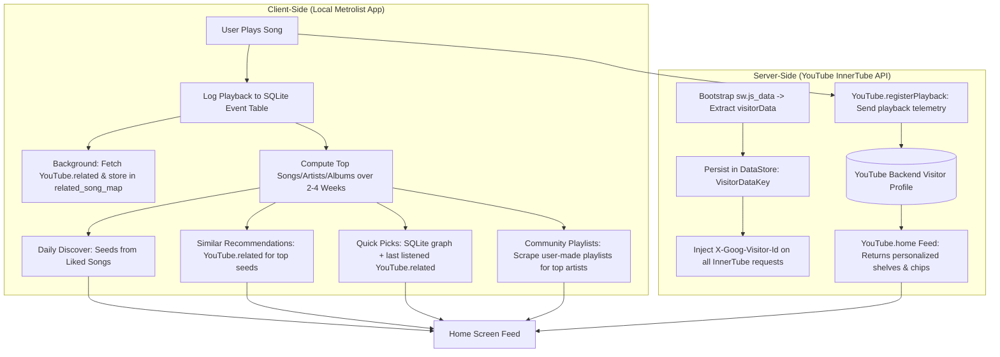

# Metrolist Anonymous Recommendation Engine Architecture

This document details how Metrolist generates, tracks, and personalizes recommendations without requiring the user to be logged into a YouTube account.

---

## 1. System Architecture Overview

Metrolist uses a **two-tier hybrid recommendation architecture**:
1. **Server-Side Anonymous Session Tracking** via YouTube's `visitorData` token (`X-Goog-Visitor-Id`) and playback telemetry (`registerPlayback`).
2. **Client-Side Algorithmic Synthesis** where Metrolist analyzes local SQLite listening history (`event`, `song`, `playCount`) and queries YouTube's contextual graph endpoints (`next`, `related`, `artist`, `album`, `radio`) dynamically.

---

## 2. Server-Side Anonymous Tracking (`visitorData`)

Even without an authenticated Google account, YouTube maintains anonymous session profiles tied to a visitor ID.

### A. Extracting and Persisting `visitorData`
- On app launch, `App.kt` checks for a cached `VisitorDataKey` in Android DataStore.
- If missing, it invokes `YouTube.visitorData()`, which makes a request to YouTube's Service Worker bootstrap script (`sw.js_data`) and extracts the `visitorData` token via regex match.
- This token is saved to DataStore and bound to `YouTube.visitorData`.

### B. Attaching Visitor Identity to All InnerTube Requests
- In `InnerTube.kt` (`ytClient`), every HTTP request sent to YouTube Music attaches:
  - Header: `X-Goog-Visitor-Id: <visitorData>`
  - Body context: `Context.client.visitorData`
- This ensures that YouTube correlates API queries across sessions to the same anonymous visitor container.

### C. Reporting Playback Telemetry
- In `MusicService.kt`, when a song plays past `historyDurationMs` (e.g. 10–30s threshold):
  1. The app retrieves the `videostatsPlaybackUrl` from the YouTube `player` endpoint response.
  2. It invokes `YouTube.registerPlayback(playbackUrl)`, generating a random Client Playback Nonce (`cpn`) and passing telemetry parameters (`ver=2`, `c=WEB_REMIX`, `cpn`, `list`).
- **Effect**: YouTube's recommendation engine logs the playback event against the anonymous `visitorData` profile. When `YouTube.home()` (`browseId = "FEmusic_home"`) is called, YouTube returns personalized home carousels and mood/genre chips tailored to that anonymous listening history.

---

## 3. Client-Side Algorithmic Recommendation Engine

To avoid complete dependency on YouTube's black-box home feed, Metrolist builds rich recommendation shelves in `HomeViewModel.kt` by combining local SQLite analytics with YouTube contextual endpoints.

### A. The Related Song Graph (`related_song_map`)
- In `MusicService.kt`, whenever a track is played:
  1. It queries `YouTube.next(WatchEndpoint(videoId = mediaId))` to fetch the track's `relatedEndpoint`.
  2. It invokes `YouTube.related(relatedEndpoint)`.
  3. The returned related tracks are upserted into the local SQLite database, and relationships are written into the `related_song_map` table (`songId` -> `relatedSongId`).

### B. "Quick Picks" Generation
- Located in `HomeViewModel.getQuickPicks()`:
  1. Executes a SQL graph query (`DatabaseDao.quickPicks()`) joining `related_song_map` against the user's top-played songs in the last 7 days and all-time history.
  2. Identifies the user's most recently played song from the `event` table, queries YouTube's `related` endpoint for that song in real time, and finds matches in the local cache.
  3. Blends in forgotten favorites and shuffles them into a dynamic 20-track recommendation tray.

### C. "Similar To..." (Artist, Song, and Album Recommendations)
- In `HomeViewModel.kt`:
  - **Songs**: Fetches the top-played songs from the last 2 weeks (`database.mostPlayedSongs`), queries `YouTube.next` -> `YouTube.related` for each seed, and builds "Similar to [Track]" shelves containing tracks, albums, artists, and playlists.
  - **Artists**: Takes top-played artists (`database.mostPlayedArtists`), queries `YouTube.artist(artistId)`, and collects their latest sections/releases.
  - **Albums**: Takes top-played albums (`database.mostPlayedAlbums`), queries `YouTube.album(albumId)` and the artist's page to fetch related versions and similar releases.

### D. "Daily Discover"
- Located in `HomeViewModel.getDailyDiscover()`:
  - Samples 5 random tracks from the user's locally liked songs (`likedSongsByCreateDateAsc`).
  - Asynchronously queries YouTube's `next` and `related` endpoints for each seed track.
  - Deduplicates, filters out explicit/video songs (if configured), and surfaces fresh candidate recommendations.

### E. "Community Playlists"
- Located in `HomeViewModel.getCommunityPlaylists()`:
  - Analyzes top-played artists and songs from the last 4 weeks.
  - Queries `YouTube.artist` and `YouTube.related` to discover user-curated public playlists (filtering out YouTube auto-generated radios starting with `RD` or `OLAK`).
  - Fetches full playlist tracklists to display rich community recommendations.

### F. Infinite Radio Queue (`YouTubeQueue`)
- In `YouTubeQueue.kt`:
  - When playing a track in radio mode, Metrolist queries `WatchEndpoint(playlistId = "RDAMVM<videoId>")` to stream YouTube's algorithmic radio station.
  - If the radio response returns fewer than 2 items, it falls back to querying `YouTube.related` to build a continuous stream of similar songs.

---

## 4. Key Takeaways for Echo Desktop

| Pattern | Metrolist Implementation | Applicability to Echo Desktop |
| :--- | :--- | :--- |
| **Anonymous Session ID** | Scrapes `visitorData` from `sw.js_data`, caches it, and passes `X-Goog-Visitor-Id`. | Can be used by sandboxed Extism WASM provider plugins for provider-side guest personalization. |
| **Local Graph Cache** | `related_song_map` in SQLite populated during playback. | Fits Echo's local embedded `rusqlite` database model without taxing remote APIs repeatedly. |
| **Seed-Driven Exploration** | Recent/top local plays act as seeds to fetch related trees (`next` -> `related`). | Direct fit for Echo's core loop: Seed track -> WASM extension resolves next track. |
| **Auto-Radio Queue** | Employs `RDAMVM<videoId>` with fallback to `related`. | Echo can leverage provider-specific algorithmic radio endpoints for endless playback. |
