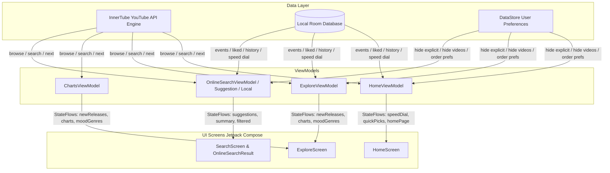

# Comprehensive Architectural & Implementation Report: Metrolist Home, Search, and Explore

Metrolist is an open-source Android music player built with **Jetpack Compose**, **Kotlin Coroutines / Flow**, **Room Database**, and an internal **InnerTube** engine (reverse-engineered YouTube Music API client).

This report breaks down how Metrolist builds its **Home**, **Explore**, and **Search** pages from API extraction to state management and Compose UI rendering.

---



---

## 1. Home Page (`HomeScreen` & `HomeViewModel`)

The Home Page combines local playback history and remote YouTube Music recommendations into a dynamic, personalized dashboard.

### 1.1 Multi-Phase Data Loading Strategy
To ensure the UI renders instantly without waiting for network-heavy API round-trips, `HomeViewModel.kt` uses a **two-phase asynchronous pipeline**:

```
load() Triggered
 ├── Phase 1 (Parallel Fast Load — sets isLoading = false immediately after)
 │    ├── getQuickPicks() (Local DB play frequency + YouTube related songs)
 │    ├── forgottenFavorites (Local DB songs unplayed for a period)
 │    ├── keepListening (Local DB top songs, albums, artists from past 2 weeks)
 │    ├── YouTube.home() (Remote YouTube Music landing page)
 │    └── loadAccountPlaylists() (If logged into YouTube account)
 └── Phase 2 (Heavy Multi-Request Operations — Background Coroutines)
      ├── getDailyDiscover() (Picks 5 seed liked songs -> fetches YouTube related songs)
      ├── getCommunityPlaylists() (Fetches artist/song seed playlists -> resolves contents)
      ├── YouTube.explore() (Moods & genres and new release hook)
      └── similarRecommendations (Fetches related recommendations for top artists/albums)
```

### 1.2 Algorithmic Hybrid Sections
Metrolist generates several custom algorithmic sections beyond what YouTube Music returns:

1. **Speed Dial (27-item grid)**:
   - Priority 1: User-pinned items from `database.speedDialDao.getAll()`.
   - Priority 2: Heavy rotation items from `keepListening` (Local DB history from past 2 weeks).
   - Priority 3: Items from `quickPicks` until exactly 27 slots are filled.
2. **Daily Discover**:
   - Randomly samples 5 tracks from the user's local `likedSongs`.
   - Queries `YouTube.next(videoId).relatedEndpoint` -> `YouTube.related(endpoint)`.
   - Formats them with UI contextual tags like *"Because you listen to [Seed Title]"*, *"Sounds like [Artist]"*, or *"For fans of [Artist]"*.
3. **From the Community**:
   - Picks top YouTube artists/songs from the past 4 weeks.
   - Discovers public community-curated playlists (excluding official YouTube/radio algorithmic playlists with IDs starting with `RD` or `OLAK`).
   - Fetches the first 10 tracks and renders a 2x2 grid artwork card.
4. **Similar Recommendations**:
   - Discovers songs, albums, and artists related to the user's top-played local catalog.
5. **Quick Picks**:
   - Merges local database high-frequency tracks, forgotten favorites, and YouTube related songs.

### 1.3 Weighted Dynamic Section Ordering & Randomization
Sections can be laid out in default hierarchical order or dynamically shuffled on each app refresh using a seeded randomizer (`RandomizeHomeOrderKey`):

```kotlin
// Stable session seed ensures sections do not jump during scrolling/recomposition
val sectionRandom = Random(randomSeed + section.id.hashCode())
val base = when (section) {
    HomeSection.SpeedDial, HomeSection.QuickPicks, HomeSection.DailyDiscover -> 500 // Top tier
    HomeSection.KeepListening, HomeSection.AccountPlaylists, 
    HomeSection.ForgottenFavorites, HomeSection.FromTheCommunity -> 300           // Middle tier
    else -> 100                                                                   // Bottom tier
}
val modifier = when (section) {
    HomeSection.SpeedDial, HomeSection.QuickPicks, HomeSection.DailyDiscover -> sectionRandom.nextInt(-200, 400)
    HomeSection.KeepListening, ... -> sectionRandom.nextInt(-100, 400)
    else -> sectionRandom.nextInt(-50, 50)
}
val finalWeight = base + modifier
```

### 1.4 YouTube InnerTube Home Parsing (`HomePage.kt`)
Metrolist calls `browse(browseId = "FEmusic_home")` or `browseContinuation` via `WEB_REMIX` client context. It extracts:
- **Chips**: Extracted from `sectionListRenderer.header.chipCloudRenderer` (e.g., *Podcasts*, *Relax*, *Energize*, *Workout*). Tapping a chip reloads the page with `chip.endpoint.params`.
- **Carousels**: Parsed from `MusicCarouselShelfRenderer` containing:
  - `MusicTwoRowItemRenderer` -> mapped to `SongItem`, `AlbumItem`, `ArtistItem`, `PlaylistItem`, or `PodcastItem`.
  - `MusicResponsiveListItemRenderer` -> mapped to quick pick songs.
  - `MusicMultiRowListItemRenderer` -> mapped to podcast episodes.

---

## 2. Explore Page (`ExploreScreen`, `ExploreViewModel`, `ChartsViewModel`)

The Explore Page provides trending global charts, newly released albums, and mood/genre navigation categories.

```
ExploreScreen
 ├── Charts Section (ChartsViewModel -> YouTube.charts())
 │    └── Horizontal snap-scrolling 4-row grid of Trending Songs
 ├── New Release Albums (ExploreViewModel -> YouTube.explore())
 │    └── Horizontally scrollable row of Album Cards (Custom-sorted by favorite artists)
 ├── Top Music Videos (ChartsPage -> "Top music videos" section)
 │    └── Horizontally scrollable row of Video Cards
 └── Moods & Genres (ExplorePage -> YouTube.moodAndGenres())
      └── 4-row Horizontal Grid of styled category buttons
```

### 2.1 API Ingestion
1. **Explore Endpoint (`FEmusic_explore`)**:
   - Fetches `ExplorePage` which contains:
     - `newReleaseAlbums`: Parsed from the section where `browseId == "FEmusic_new_releases_albums"`.
     - `moodAndGenres`: Parsed from navigation buttons where `browseId == "FEmusic_moods_and_genres"`.
2. **Charts Endpoint (`FEmusic_charts`)**:
   - Queries country-specific charts based on user settings (`countryCode`).
   - Retrieves sections: `Trending`, `Top songs`, `Top music videos`, `Top artists`.

### 2.2 Personalized New Release Sorting
Metrolist re-ranks the global YouTube New Releases using the user's local database profile:
```kotlin
// In ExploreViewModel.kt
val artists = database.allArtistsByPlayTime().first()
val favouriteArtists = artists.filter { it.artist.bookmarkedAt != null }

page.newReleaseAlbums.sortedBy { album ->
    val artistIds = album.artists.orEmpty().mapNotNull { it.id }
    // Bubble up releases by bookmarked artists first, then by total playtime
    val firstArtistKey = artistIds.firstNotNullOfOrNull { artistId ->
        if (artistId in favouriteArtists.values) {
            favouriteArtists.entries.firstOrNull { it.value == artistId }?.key
        } else {
            artists.entries.firstOrNull { it.value == artistId }?.key
        }
    } ?: Int.MAX_VALUE
    firstArtistKey
}
```

### 2.3 UI & Snap Carousel Rendering
- **4-Row Horizontal Track Grid**: Uses `LazyHorizontalGrid(rows = GridCells.Fixed(4))` with a custom `SnapLayoutInfoProvider` and `rememberSnapFlingBehavior` to snap entire columns on swipe.
- **Skeleton Shimmer**: Displays `ShimmerHost` with placeholders for titles, grid rows, and category buttons while data is fetching.

---

## 3. Search Page Architecture

Metrolist separates Search into a **Dispatcher (`SearchScreen`)**, an **Online Engine (`OnlineSearchScreen` & `OnlineSearchResult`)**, and a **Local Engine (`LocalSearchScreen`)**.

```
SearchScreen (Root Container)
 ├── TopAppBar (BasicTextField + Close Button + Online/Local Source Toggle)
 ├── Quick URL Parsing (Intercepts pasted URLs -> Video / Playlist / Album / Artist)
 ├── Floating Action Button (Mic -> Audio/Song Recognition)
 └── Search Body (Switch based on Source Mode):
      ├── Mode A: SearchSource.LOCAL -> LocalSearchScreen
      │    ├── Fast SQLite LIKE queries (Songs, Albums, Artists, Playlists)
      │    └── Filter Tabs: ALL, SONG, ALBUM, ARTIST, PLAYLIST
      └── Mode B: SearchSource.ONLINE -> OnlineSearchScreen & OnlineSearchResult
           ├── Input Phase (OnlineSearchScreen):
           │    ├── Local Search History chips (deleteable)
           │    ├── Live Auto-complete queries (debounced 300ms)
           │    └── Direct Item previews from suggestion endpoint
           └── Result Phase (OnlineSearchResult):
                ├── Chips Row: All, Songs, Videos, Albums, Artists, Playlists, Episodes, Podcasts
                ├── Summary View (when Filter = ALL): Multi-section categorized cards
                └── Filtered View: Infinite scrolling list with continuation tokens
```

### 3.1 Live URL Interception & Handling
If the user pastes a raw YouTube link into the search box, `YouTubeUrlParser` parses the URL pattern and extracts the target:
- `youtu.be/<id>` or `youtube.com/watch?v=<id>` -> Immediately creates a `YouTubeQueue` and plays the track.
- `youtube.com/playlist?list=<id>` -> Navigates to `online_playlist/<id>`.
- `youtube.com/channel/<id>` or `/browse/<id>` -> Navigates to `artist/<id>` or `album/<id>`.
- Plain text -> Initiates standard search.

### 3.2 Search Suggestions & Auto-Complete (`OnlineSearchSuggestionViewModel`)
- Text changes are debounced by `300ms` using `snapshotFlow { query }.debounce(300L)`.
- Calls `YouTube.searchSuggestions(query)` which parses:
  - Textual completion strings (`queries`).
  - Rich entity cards (`recommendedItems`) parsed from `searchSuggestionRenderer` (e.g. artist direct matches, song quick picks).
- Combines live suggestions with un-duplicated recent searches from `database.searchHistory(query)`.

### 3.3 Search Results & Continuation (`OnlineSearchViewModel`)
1. **Summary Search (`filter == null` / "All" tab)**:
   - Calls `YouTube.searchSummary(query)` using `InnerTube.search(browseId = null, params = null)`.
   - Parses `MusicCardShelfRenderer` (the "Top Result" card) and `MusicShelfRenderer` (categorized sections like *Songs*, *Albums*, *Featured Playlists*, *Community Playlists*, *Artists*).
   - Runs `YouTube.resolveArtistIds(...)` to enrich items with valid channel IDs.
2. **Filtered Search (e.g., Songs, Albums, Artists, Playlists)**:
   - Passes specific filter protobuf tokens (`FILTER_SONG = "Eg-KAQwIARAAGAAgACgAMABqChAMEAEYBxAFEAc%3D"`, `FILTER_ALBUM = "Eg-KAQwIABAAGAAgACgAMABqChAMEAEYBxAFEAc%3D"`, etc.).
   - Stores results in a reactive cache map: `viewStateMap[filter.value] = ItemsPage(items, continuation)`.
3. **Infinite Pagination**:
   - `loadMore()` triggers `YouTube.searchContinuation(continuation)` when the user reaches the end of the list.

### 3.4 Local Search Architecture (`LocalSearchViewModel`)
When toggled to `SearchSource.LOCAL`, the search is handled purely on-device via Room DAO queries:
```kotlin
// In LocalSearchViewModel.kt
combine(
    database.searchSongs(query, PREVIEW_SIZE),
    database.searchAlbums(query, PREVIEW_SIZE),
    database.searchArtists(query, PREVIEW_SIZE),
    database.searchPlaylists(query, PREVIEW_SIZE),
) { songs, albums, artists, playlists ->
    songs + albums + artists + playlists
}
```
When filtered to a specific category (e.g., `LocalFilter.SONG`), the preview limit is removed to return all matching SQLite rows.

---

## 4. Key Architectural Patterns Summary

| Area | Metrolist Implementation Pattern | Key Benefit |
|---|---|---|
| **API Parsing** | Structural pattern matching over polymorphic InnerTube JSON renderers (`MusicTwoRowItemRenderer`, `MusicResponsiveListItemRenderer`, etc.). | Resilient against YouTube Music schema changes without crashing. |
| **Data Hygiene** | Global filters applied at ViewModel layer (`filterExplicit()`, `filterVideoSongs()`, `filterYoutubeShorts()`). | User settings are strictly respected across all feeds and search filters. |
| **Concurrency** | Room DB queries run in `Dispatchers.IO`; Two-phase load in `HomeViewModel`; `debounce` on search inputs. | Smooth 60/120fps UI performance without main-thread jank. |
| **State Management** | StateFlows + Jetpack Compose `collectAsStateWithLifecycle()` + `rememberSaveable`. | Survives screen rotation and process death while minimizing recompositions. |
| **Personalization** | Hybrid ranking (Local Room play metrics + YouTube related endpoints + seeded randomizer). | Provides an algorithmic feed without requiring a dedicated backend server. |