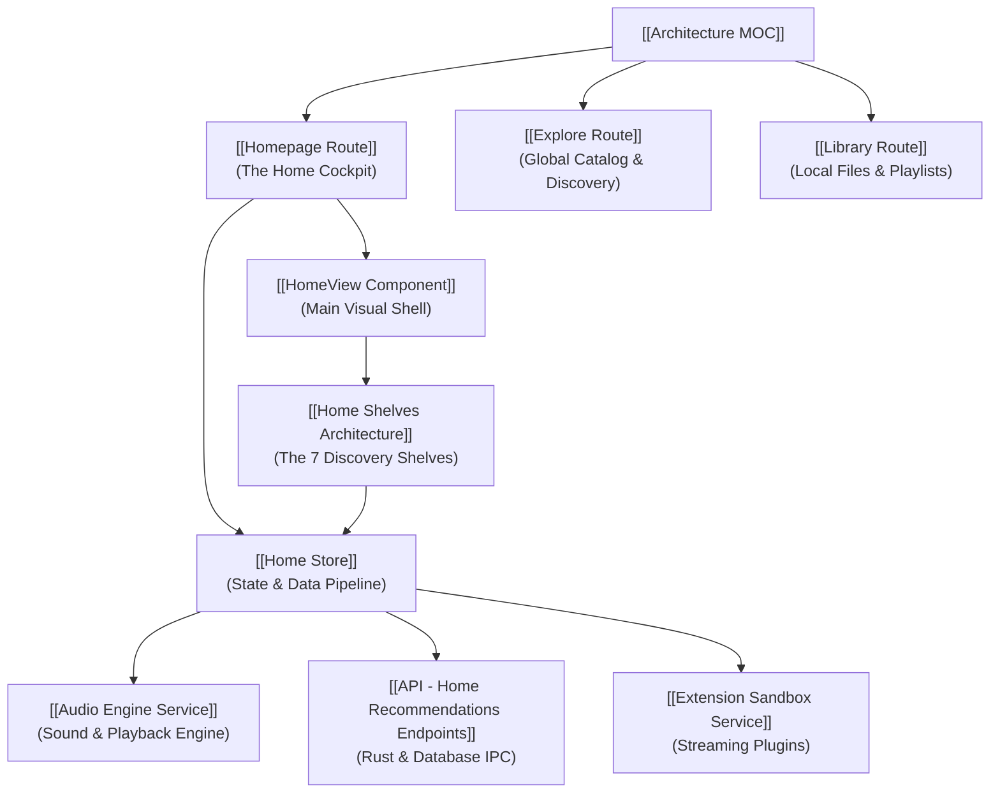

# Architecture Map of Content (MOC)

## What is Echo? (High-Level Overview)
**Echo** is an intelligent desktop music player designed around one core idea: **your music player should adapt to your personal listening habits without invading your privacy or requiring complex manual playlists.**

Instead of forcing you to organize folders or manually build queues, Echo learns what you enjoy locally on your computer and dynamically compiles fresh daily recommendations, algorithmic radio stations, and nostalgic throwbacks. It combines fast local file playback (FLAC, MP3, WAV) with federated discovery from online streaming extensions.

---

## The Big Picture: How the System Fits Together

Echo is split into four distinct layers:

1. **User Interface Layer (Frontend):**
   * Built with **Svelte 5 (Runes)** and modern web technologies.
   * Acts like a remote control: it stays lightweight, fast, and responsive without heavy data processing.

2. **State & Orchestration Layer (Stores):**
   * Manages data flow, coordinates when to fetch recommendations, and handles instant UI updates (like liking a song).
   * [[Home Store]] coordinates the two-phase loading process so the user never sees an empty, sluggish screen.

3. **Desktop & System Bridge (Tauri 2.0 & Rust):**
   * Runs natively on your operating system.
   * Handles local database queries in SQLite, background file indexing, and OS media keys (play/pause buttons on your keyboard).

4. **Audio Engine & Extension Sandbox (Rust & Extism WASM):**
   * Plays lossless audio seamlessly through a dedicated audio thread.
   * Runs sandboxed plugin scripts (WASM) to search and stream remote songs without risking application stability.

---

## Core Knowledge Domains & Navigation

### 1. Application Routes (Where the User Goes)
* [[Homepage Route]] — The primary personalized dashboard, mood filter bar, and daily listening feed.
* `[[Explore Route]]` — Global discovery, trending charts, mood taxonomies, and remote catalog searches.
* `[[Library Route]]` — Local SQLite catalog browser for albums, tracks, and local playlists.
* `[[Artist Detail Route]]` — Dynamic artist profiling, local & remote discography merging.
* `[[Settings Route]]` — Audio output device selectors, indexing directories, and extension configurations.

### 2. State & Services (How Data Moves)
* [[Home Store]] — Svelte 5 Rune-based reactive store powering the two-phase recommendation pipeline.
* `[[Audio Engine Service]]` — Rodio-based lock-free playback state machine and OS MPRIS/SMTC integration.
* `[[Library Service]]` — SQLite local library indexing, playlist management, and favorites store.
* `[[Explore Service]]` — Federated provider catalog search and remote detail resolution.
* `[[Extension Sandbox Service]]` — Extism WASM sandboxed provider runtime with async `reqwest` HTTP capabilities.

### 3. Component Architecture (What the User Sees)
* [[Home Shelves Architecture]] — The 7 Ego Shelves (Quick Picks, Jump Back In, Daily Discover, Radio Mixes, Adjacent Horizons, Heavy Rotation, Forgotten Favorites).
* `[[PlayerBar Component]]` — Bottom-anchored persistent playback controls, progress interpolation, and volume slider.
* `[[FullScreenPlayer Component]]` — Immersive full-window playback canvas with synchronized lyric rendering.
* `[[QueueSidebar Component]]` — Active playback queue management, drag-and-drop reordering, and Up Next resolution.
* `[[GlobalSearch Component]]` — Universal fuzzy modal search across local SQLite metadata and remote WASM providers.

### 4. Backend APIs & IPC Bridge (How the Engine Works)
* [[API - Home Recommendations Endpoints]] — Rust recommendation compiler, SQLite telemetry heuristics, and federated radio streams.
* `[[API - Audio Engine Endpoints]]` — Rust commands for sink management, track loading, seeking, and volume control.
* `[[API - Library Indexer Endpoints]]` — Background directory scanner, ID3/FLAC metadata parser, and SQLite caching.
* `[[API - Provider Extension Endpoints]]` — Sandboxed WASM lifecycle hooks and attestation engine.

---

## Architectural Guarantees & Philosophy
* **Privacy by Default:** Your listening history never leaves your device. All recommendation math runs locally on SQLite.
* **Instant Start (<10ms):** The UI shows your local favorites immediately before waiting on remote network calls.
* **Zero UI Freezes:** Heavy audio processing and database lookups run on separate background threads.
