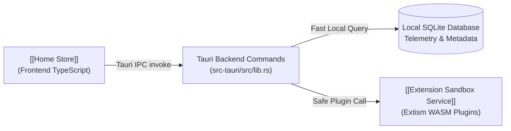

# API - Home Recommendations Endpoints

## In Plain English: What are These Endpoints?
These endpoints form the **bridge between the visual frontend and the native Rust backend**. When the user opens the homepage, clicks a mood pill, or plays a song, the frontend calls these functions via **Tauri IPC** (Inter-Process Communication).

Their main jobs are:
1. **Querying Local Listening History:** Computing your favorite songs, 7-day heavy rotation, and forgotten favorites from your private SQLite database.
2. **Talking to Sandboxed Plugins:** Safely asking online WASM extensions for fresh recommendations and infinite radio streams.
3. **Saving Play Events & Likes:** Recording your listening habits locally so recommendations get smarter over time.



---

## Command Reference Summary

| Command Name | Speed | Purpose | Return Data |
| :--- | :--- | :--- | :--- |
| **`get_home_local_shelves`** | Fast (<10ms) | Loads all local telemetry shelves (Quick Picks, Heavy Rotation, Jump Back In, Forgotten Favorites). | `HomeLocalShelves` object |
| **`get_home_remote_shelves`** | Async (Network) | Queries online WASM plugins for daily discovery tracks based on your taste. | `FederatedShelfResult` object |
| **`get_home_radios`** | Fast (<20ms) | Generates algorithmic radio station cards for top artists and current moods. | List of `RadioMixCard` items |
| **`get_home_adjacent_horizon`** | Fast (<20ms) | Calculates a genre-bridging recommendation to help you explore new styles. | `AdjacentHorizonPayload` or null |
| **`record_track_play`** | Background | Saves a play event to SQLite to update play counts and recency algorithms. | `Result<(), String>` |
| **`toggle_track_like`** | Background | Saves or removes a song from your liked favorites. | `Result<bool, String>` |

---

## Technical Command Signatures & Rust Implementation

### 1. `get_home_local_shelves`
Fetches all local-first recommendation shelves in a single batch query.

```rust
#[tauri::command]
async fn get_home_local_shelves(
    state: State<'_, AppState>,
    mood: Option<String>,
) -> Result<providers::recommendations::HomeLocalShelves, String>
```
* **Parameters:** `mood` (`Option<String>`): Filter by mood (e.g., `"Deep Focus"`, `"Energy & Drive"`), or `None` for all music.
* **Why it's fast:** Reads indexed local SQLite tables using pre-compiled queries.

---

### 2. `get_home_remote_shelves`
Queries online extensions for daily recommendations.

```rust
#[tauri::command]
async fn get_home_remote_shelves(
    state: State<'_, AppState>,
    mood: Option<String>,
) -> Result<providers::recommendations::FederatedShelfResult, String>
```
* **Cancellation Protection:** Uses a `tokio_util::sync::CancellationToken`. If you click another mood while a remote search is still in flight, the old request is immediately canceled to save bandwidth and CPU.

---

### 3. `record_track_play`
Logs listening telemetry whenever a track starts or finishes playing.

```rust
#[tauri::command]
async fn record_track_play(
    state: State<'_, AppState>,
    title: String,
    artist: String,
    album: Option<String>,
    cover_art_url: Option<String>,
    provider_id: String,
    source_id: String,
    duration_ms: Option<u64>,
) -> Result<(), String>
```
* **Effect:** Updates play count deciles, logs timestamps for the 30-day "Forgotten Favorites" math, and records session completion percentages.

---

## Concurrency & Safety Rules
* **No Database Blocking:** All SQLite queries execute inside `tokio::task::spawn_blocking` or through dedicated channel actors so the user interface never stutters.
* **Memory & Sandbox Security:** Remote WASM extensions run with strict memory allocation limits and timeout caps to ensure third-party scripts can never crash the app or leak memory.
* **Error Sanitization:** All internal database and network errors are converted to human-readable strings before returning to the frontend.

---

## Related Notes
* [[Home Store]] — The frontend store calling these commands.
* [[Homepage Route]] — The primary user interface displaying the resulting data.
* `[[Extension Sandbox Service]]` — Sandboxed WASM plugin environment executing remote calls.
