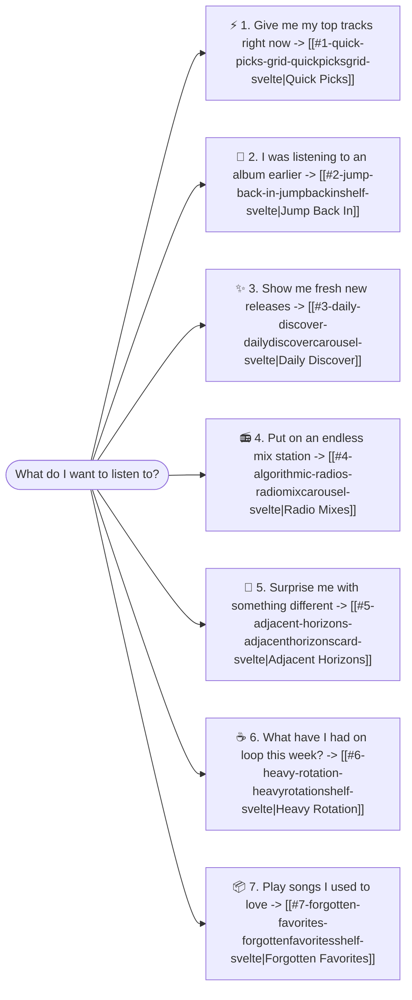

# Home Shelves Architecture

## In Plain English: What are the Home Shelves?
The **Home Shelves** (also called the **7 Ego Shelves**) are the building blocks of your homepage. Rather than giving you a generic wall of albums, Echo divides your listening habits into 7 distinct, intuitive sections.

Each shelf answers a specific everyday listening question:

---

## Detailed Tour of the 7 Ego Shelves

### 1. Quick Picks Grid (`QuickPicksGrid.svelte`)
* **Plain English:** Your personal "hit list" — the 8 songs you listen to most frequently right now.
* **What it looks like:** A responsive 4-column matrix of sleek audio cards with album artwork, song title, artist, and duration.
* **Interactive Details:**
  * **Live Equalizer Animation:** When a song is playing, an animated 3-bar equalizer dances in place of the play button.
  * **Inline Heart Button:** Allows liking or unliking the track on the spot.
  * **Highlighted Border:** Glowing gold border when the track is currently active.

---

### 2. Jump Back In (`JumpBackInShelf.svelte`)
* **Plain English:** Pick up where you left off.
* **What it looks like:** Horizontal cards for albums or playlists you paused halfway through.
* **Interactive Details:**
  * Displays a visual progress bar (e.g. *Track 6 of 14 — 42% complete*).
  * Clicking the card resumes playback from the exact track you were on.

---

### 3. Daily Discover (`DailyDiscoverCarousel.svelte`)
* **Plain English:** Fresh daily music curated from online streaming extensions based on your taste.
* **What it looks like:** A scrollable carousel of recommended tracks updated every 24 hours.
* **Interactive Details:**
  * Displays smooth placeholder skeletons while remote extensions are fetching.
  * Gracefully hides failed providers if your internet connection is offline.

---

### 4. Algorithmic Radios (`RadioMixCarousel.svelte`)
* **Plain English:** Infinite "radio stations" built around your favorite artists and moods.
* **What it looks like:** Vibrant gradient cards featuring dynamic multi-cover artwork collages.
* **Interactive Details:**
  * Categorized as either **Artist Radio** (e.g. *Radio based on Radiohead*) or **Mood Radio** (e.g. *Late Night Drift Mix*).
  * One click queues up an endless playlist of matching songs.

---

### 5. Adjacent Horizons (`AdjacentHorizonsCard.svelte`)
* **Plain English:** The serendipity engine — introduces you to new genres just outside your usual comfort zone.
* **What it looks like:** A split hero card explaining *why* the music was suggested (e.g. *"Because you listen to Ambient, explore IDM & Modular Synth"*).
* **Interactive Details:**
  * Shows a preview tracklist that you can sample directly from the card.

---

### 6. Heavy Rotation (`HeavyRotationShelf.svelte`)
* **Plain English:** Your 7-day leaderboard — who and what you've had on repeat all week.
* **What it looks like:** Two rows:
  * **Top Artists:** Circular artist avatar badges with total weekly play counts.
  * **Top Albums:** Square album sleeves ranked by how many times you spun them.

---

### 7. Forgotten Favorites (`ForgottenFavoritesShelf.svelte`)
* **Plain English:** The nostalgia machine — brings back songs you used to play constantly, but haven't touched in over a month.
* **What it looks like:** A shelf of familiar favorites tagged with time reminders (e.g. *"Last played 45 days ago"*).

---

## Cold-Start View: First Time Users

If you just installed Echo and haven't played any music yet, the 7 shelves are replaced with an **Onboarding View**:
1. **Welcome Hero Card:** Explains how Echo learns from your music and invites you to explore.
2. **Library Starter Seeds Grid:** Displays a selection of songs from your newly scanned local library so you can click one and start your listening journey immediately.

---

## Visual Design & Aesthetics

All shelves follow Echo's signature **Dark Luxury** aesthetic:
* **Backgrounds:** Deep charcoal (`#0E0E10`) and surface card dark gray (`#141416`).
* **Accents:** Warm vintage gold (`#B58E62`) for play buttons, active borders, and equalizer animations.
* **Typography:** Elegant serif headers (`Playfair Display`) paired with clean monospace labels and tags.
* **Feel:** Micro-hover elevations and buttery-smooth transitions for every interactive button.

---

## Related Notes
* [[Homepage Route]] — The page that arranges and displays these shelves.
* [[Home Store]] — The reactive state store that feeds data into these shelves.
* `[[Audio Engine Service]]` — Sound engine executing playback when shelf cards are clicked.
