# Home Store

## In Plain English: What Does the Home Store Do?
The **Home Store** (`src/lib/stores/home.svelte.ts`) is the **brain behind the homepage**. It is responsible for gathering everything you see on the dashboard, making sure music starts playing when clicked, and remembering what you like.

Its three biggest jobs are:
1. **The Fast 2-Phase Load:** When you open the app, it loads your local favorites in less than 10 milliseconds from your computer's database. Then, in the background, it talks to online plugins to fetch fresh recommendations without freezing your screen.
2. **Smart Playback Resolution:** When you click a song, the store figures out whether the file is already on your hard drive (lossless instant play) or needs to be resolved through an online streaming extension.
3. **Instant Likes & Telemetry:** When you heart a song on any shelf, it instantly updates across all shelves and saves your preference to your local database.

```mermaid
sequenceDiagram
    autonumber
    participant UI as HomeView (User Interface)
    participant Store as homeStore (State Brain)
    participant DB as SQLite Local Database
    participant Ext as Sandboxed WASM Plugins
    participant Audio as Audio Playback Engine

    UI->>Store: Open Homepage (or switch mood)
    
    rect rgb(35, 45, 65)
    Note over Store,DB: Phase 1: Instant Local Load (<10ms)
    Store->>DB: Query local play history & favorites
    DB-->>Store: Return Quick Picks, Heavy Rotation, Jump Back In
    Store-->>UI: Display local shelves immediately
    end

    rect rgb(45, 55, 35)
    Note over Store,Ext: Phase 2: Background Remote Discovery
    Store->>Ext: Fetch daily recommendations & radio mixes
    Ext-->>Store: Return online track suggestions
    Store-->>UI: Populate Daily Discover & Radio Carousels
    end

    UI->>Store: User clicks a track to play
    alt Track is on local disk
        Store->>Audio: Play local file path
    else Track is remote
        Store->>Ext: Resolve live audio stream URL
        Ext-->>Store: Stream URL
        Store->>Audio: Play audio stream
    end
```

---

## Core Data Concepts Explained Simply

* **`FederatedTrack`**: A universal song record. It can represent a local file on your computer, a track found on YouTube/Spotify, or a combination of both.
* **`IncompleteSessionItem`**: An album or playlist you were listening to earlier, remembering exactly how far you got (e.g. track 4 of 12, 45% complete).
* **`RadioMixCard`**: An endless algorithmic radio station based on an artist or a mood, styled with custom gradients and album art collages.
* **`AdjacentHorizonPayload`**: A recommendation that gently nudges you into a new genre related to your favorite music.

---

## Technical Design & Two-Phase Hydration

Built with **Svelte 5 Runes** (`$state`, `$derived`), the store maintains strict isolation between fast local data and network-dependent remote data:

### Phase 1: Local Telemetry Fetch (<10ms)
Calls `invoke("get_home_local_shelves", { mood })`. The Rust backend scans local SQLite tables and immediately populates:
* `quickPicks`
* `jumpBackIn`
* `heavyRotation`
* `forgottenFavorites`
* `coldStartSeeds`

### Phase 2: Remote Discovery Fetch (Async & Cancelable)
Fires concurrent async calls with `Promise.allSettled`:
* `get_home_radios` — Compiles dynamic radio station seeds.
* `get_home_adjacent_horizon` — Calculates genre bridging.
* `get_home_remote_shelves` — Queries WASM provider extensions.

### Race Condition Protection
If the user rapidly clicks different moods (e.g., *Focus* → *Energy* → *Chill*), each request increments `currentFetchId`. Any delayed responses from older clicks are automatically discarded so your screen never displays outdated results.

---

## Key Store Methods

### `playFederatedTrack(track: FederatedTrack)`
1. Checks if the song exists locally (`sources.type === "Local"`). If yes, plays the local file instantly.
2. If remote and the stream URL is already known, streams it directly.
3. If unstreamed, shows a toast notification (`Resolving stream for...`), queries the WASM plugin to fetch a live stream URL, and sends it to `audioStore`.
4. Asynchronously logs the play event to your local telemetry database.

### `toggleLike(track: FederatedTrack)`
Toggles the like status in the backend SQLite database and synchronizes the heart icon across all shelves (`Quick Picks`, `Daily Discover`, `Forgotten Favorites`) in real time.

### `resumeSession(session: IncompleteSessionItem)`
Restores an unfinished album or playlist right where you left off, queuing up the remaining songs automatically.

---

## Related Notes
* [[Homepage Route]] — The UI view driven by this store.
* [[Home Shelves Architecture]] — The components that display this store's data.
* [[API - Home Recommendations Endpoints]] — The backend endpoints providing data to this store.
* `[[Audio Engine Service]]` — The sound engine that plays tracks dispatched by this store.
