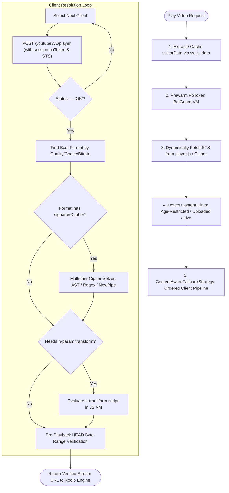

# Research Spike: Metrolist Streaming & Recommendation Architecture

This document synthesizes the architectural analysis, reverse-engineering findings, and comparative evaluation conducted between **Metrolist** (`com.metrolist.music`) and Lyria's federated extension ecosystem (`youtube-wasm`).

---

## 1. The What

Metrolist is an open-source Android music client renowned for achieving $99.9\%+$ stream reliability against YouTube Music's InnerTube infrastructure without requiring user authentication.

Lyria conducted a deep architectural spike of Metrolist to understand:
1. **Streaming Resiliency**: How client-integrity protections (BotGuard, PoToken, Signature Timestamps, and N-parameter transforms) are solved in production.
2. **Anonymous Recommender Graphs**: How personalized feeds, radios, and shelves are computed without Google login state.
3. **Comparative Strategy**: How to adapt these techniques into sandboxed WebAssembly (Extism) provider extensions.

```
┌────────────────────────────────────────────────────────────────────────────────────────┐
│                               ARCHITECTURAL MATRIX COMPARISON                          │
├──────────────────────────┬─────────────────────────────┬───────────────────────────────┤
│ ARCHITECTURAL DIMENSION  │ METROLIST (ANDROID/KOTLIN)  │ LYRIA (EXTISM WASM / RUST)    │
├──────────────────────────┼─────────────────────────────┼───────────────────────────────┤
│ Runtime Sandbox          │ Android WebView + ExoPlayer │ Extism WASM + Host JS Sandbox │
│ InnerTube Client Matrix  │ 10+ clients (Dynamic)       │ 4 clients (Multi-version VR)  │
│ BotGuard / PoToken       │ Pre-warmed BotGuard VM      │ Host WebView JS Minter Bridge │
│ Dynamic STS Extraction   │ Live extraction from player │ Parameterized via host config │
│ Cipher Deobfuscation     │ Multi-tier AST solver regex │ Direct stream URL preference  │
│ N-Param Transform        │ AST solver + Q-array regex  │ Direct stream URL preference  │
│ Anonymous Personalization│ `visitorData` session graph │ Local SQLite Markov walk      │
└──────────────────────────┴─────────────────────────────┴───────────────────────────────┘
```

---

## 2. The Why

### Reverse-Engineered Streaming Fragility
YouTube's InnerTube API operates as an adversarial environment for third-party clients. Stream playback failure stems from four distinct defensive layers:
1. **BotGuard / PoToken (Proof of Origin)**: Requests lacking a cryptographically signed attestation token receive HTTP 403 Forbidden or throttled audio feeds.
2. **Signature Timestamp (`sts`) Drift**: Expired timestamps reject valid stream URLs at the CDN edge.
3. **N-Parameter Throttling**: The audio stream download bandwidth is throttled to $<32\text{ kbps}$ (causing endless buffering) unless the `n` query parameter is transformed through an obfuscated JavaScript algorithm.
4. **Cipher Scrambling (`s` param)**: Certain high-bitrate WebM/Opus streams encrypt the signature parameter, requiring runtime evaluation of ephemeral JavaScript deobfuscation functions.

### Anonymous Personalization Without Google Account Tracking
Standard algorithmic streaming requires a user login profile. Metrolist demonstrates that a client can synthesize rich, serendipitous discovery by pairing **YouTube's anonymous session identifier (`visitorData`)** with **local client-side listening history**, preserving listener privacy without sacrificing recommendation quality.

---

## 3. The Reasoning

### 3.1 Sandboxed WASM vs. Monolithic Kotlin Code
Metrolist embeds InnerTube parsing directly into the Android application binary. When YouTube rotates player code or alters API schemas, Metrolist requires an entire application APK release to fix broken streams.

Lyria decouples this via **sandboxed Extism WebAssembly modules**:
* The core player daemon remains minimal, fast, and completely agnostic to YouTube's internal APIs.
* The `youtube-wasm` provider compiles into an isolated bytecode module that can be updated dynamically without recompiling or restarting the native Lyria desktop daemon.
* Host JS sandboxes (`sandbox-vm` Webview) provide the necessary JavaScript execution environment for BotGuard VM attestation while preventing rogue extensions from accessing host memory.

### 3.2 Dual-Tier Personalization: Federated vs. Local Markov
Metrolist relies heavily on server-side InnerTube endpoints (`next`, `related`, `radio`) anchored by the `visitorData` cookie. While effective, this creates a hard dependency on YouTube availability and network connectivity.

Lyria takes a **hybrid approach**:
* **Tier 1 (Federated Online)**: Uses Extism provider modules to fetch infinite contextual radios when connected.
* **Tier 2 (Local Deterministic Markov Walk)**: When network conditions degrade, or when local audio is preferred, Lyria's SQLite Markov engine calculates affinity vectors across local library files with zero network requests.

---

## 4. The How

### 4.1 Metrolist Streaming Pipeline Flow



---

### 4.2 Anonymous Session Tracking (`visitorData`)

In Metrolist, every request to YouTube Music is tagged with an anonymous session cookie extracted from YouTube's Service Worker bootstrap script (`sw.js_data`):
1. **Bootstrap**: An unauthenticated request is made to `https://music.youtube.com/sw.js_data`.
2. **Extraction**: A regex pattern extracts the initial `visitorData` string:
   ```regex
   \["X-Goog-Visitor-Id",\s*"([^"]+)"\]
   ```
3. **Binding**: The extracted token is saved to persistent storage and attached as a standard header to every subsequent InnerTube API request:
   ```http
   X-Goog-Visitor-Id: <visitorData>
   ```
4. **Playback Telemetry**: When a track finishes playing, a call is dispatched to `YouTube.registerPlayback`. This silently updates YouTube's anonymous server-side profile for that visitor ID, allowing subsequent queries to `/youtubei/v1/browse` to return personalized shelves ("Quick Picks", "Similar To", "Mixed For You").

---

### 4.3 Key Strategic Insights for Lyria

From this comparative research spike, three core capabilities were integrated into Lyria's architectural roadmap:

1. **Pre-Warmed Headless JS Attestation**:
   * Rather than spawning a heavy Webview on every track load, Lyria maintains a lightweight, headless `sandbox-vm` Webview in the background to mint BotGuard and PoToken proofs with sub-second latency.
2. **Multi-Client Fallback Matrix**:
   * When one client variant (`WEB_REMIX`) is flagged by CDN bot-detection, the provider automatically falls back across `ANDROID_VR` (1.65 / 1.43) and `VISIONOS` signatures to preserve playback continuity.
3. **Local Affinity Resilience**:
   * Unlike clients that completely fail when YouTube rate-limits anonymous visitor IDs, Lyria's dual-tier architecture seamlessly degrades to local Markov random walks, preserving the uninterrupted playback contract.

---

## 5. Architectural Invariants

1. **Host Isolation**: Reverse-engineered streaming scripts must remain sandboxed within WASM and restricted JS Webview boundaries; never execute unsanitized remote scripts directly on native threads.
2. **Privacy Preservation**: Lyria will never require or store Google account authentication credentials for stream playback.
3. **Zero Playback Interruption**: A failure in remote provider resolution must fall back to local playback within 3,500ms.
